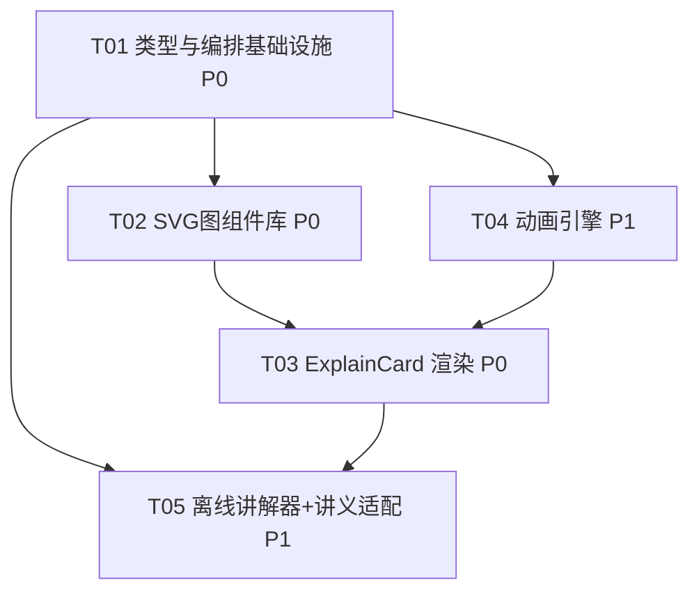

# 架构设计 + 任务分解：对话辅导详细讲解增强（POMOS）

> 文档类型：系统架构设计（架构师交付物）
> 版本：v1.0 ｜ 日期：2026-07-20 ｜ 负责人：高见远（架构师）
> 归属团队：software-tutor-rich ｜ 系统：POMOS 物理竞赛导师操作系统（CPhO/IPhO）
> 上游：PRD `prd-chat-explanation-rich-2026-07-20.md`（许清楚）
> 配套图：`docs/class-diagram.mermaid`、`docs/sequence-diagram.mermaid`

---

## 0. PRD §6 八大待确认问题 —— 拍板结论

> 结论先行：在「云端 LLM 优先 + 离线降级」与「静态图表 + 原理动画」两条既定决策下，本设计以**零新依赖、单渲染通道、IndexedDB 向前兼容**为铁律。逐条拍板如下。

| # | 待确认问题 | 拍板方案 | 理由 | 对 bundle / 降级 / 兼容的影响 |
|---|---|---|---|---|
| Q1 | 动画 DSL 由谁生成？ | **云端 LLM 生成 `animation` 参数（AnimationSpec DSL）+ 前端白名单校验**；离线用 `OFFLINE_EXPLAIN_TEMPLATES` 预置参数。校验用纯函数 `validateAnimationSpec()`（type 白名单 + 参数范围 clamp），**不执行任意代码，无需沙箱**。 | LLM 灵活但不可信，前端只认白名单内的 `{type, params}`；离线无 LLM 必须预置。 | 零新依赖；未知 type / 参数越界 → 静默降级为静态首帧，不崩。 |
| Q2 | 离线动画保底策略？ | 离线动画 = **静态首帧 + 播放按钮**（纯 SVG/CSS，不依赖 LLM）。`AnimationPlayer` 任何环境都能渲染首帧；RAF 被禁/失败则只留首帧 + 按钮（点击无动画给出提示）。**最低可用 = 静态图可见 + 按钮存在**。 | 离线无生成能力，但图必须不缺失（PRD G4）。 | 离线照样有图；bundle 无新增。 |
| Q3 | 图表库选型？ | **物理专有图（force/trajectory/vt/circuit/light/pv/wave）→ 手写 SVG 组件库**；通用图（流程/复杂曲线）→ 复用既有 Mermaid（`kind:"mermaid"`）。 | Mermaid 不擅长力分析/光路/轨迹；手绘 SVG 更可控、体积更小。 | SVG 组件每个 ~2–4KB；Mermaid **改为 dynamic import 懒加载**（当前在 MessageBubble 顶部直引，应下移）。 |
| Q4 | 云端 JSON 与流式体验？ | 讲解意图走**非流式 `chatCompletion` 取完整 JSON**（maxTokens≥2000）→ `validateExplain` → `onExplain` 一次性交付 → `ExplainCard` 前端以 **150ms 间隔逐 step 揭示**（首屏展开前 2 步，其余折叠）。**接受「先整段返回再逐步展开」替代逐字流**。 | 避免增量解析半截 JSON 出错；结构化骨架本身即 step-by-step 节奏感。 | 云端延迟略高但体验稳定；离线同理（一次性产出结构化）。 |
| Q5 | 讲解意图与 REQ-CHAT-01 讲义复用？ | **共用 `ExplainCard` + 六阶段骨架**。问导师走对话通道（`explainChat`→`onExplain`）；「生成讲义：xxx」走 `lecture.ts` 四模块，再经 `lectureToExplain()` 适配器包成 `PomosExplainV1`（四模块→前四阶段，结论/易错点补空）喂同一 `ExplainCard`（模式徽标 `lecture`）。 | 避免两套渲染逻辑分裂。 | 渲染单一化；`lecture.ts` 增适配器，不改其生成逻辑。 |
| Q6 | `ChatMessage` 扩展影响面？ | UI 类型（`MessageBubble.ChatMessage`）增 `explain?: PomosExplainV1`；存储类型（`api.ts` HistoryMessage/ChatMessage）增可选 `explain?`（`PomosExplainV1` 全为可 JSON 序列化对象，IndexedDB 直存）；`content` 仍保留 markdown 兜底。**旧消息无 explain → undefined → 走原 markdown 通道（完全兼容）**。 | 最小侵入；向后兼容历史。 | 零破坏性；历史记录缺 explain 字段即视为 undefined。 |
| Q7 | bundle / 静态导出体积？ | 新增 SVG 图组件 + `AnimationPlayer` 全用**原生实现（0 新依赖）**；`ExplainCard` 及其子组件、Mermaid 均 `next/dynamic` 懒加载（`ssr:false`）。构建产物多 chunk，带 basePath 前缀，GitHub Pages 子路径可加载。 | 静态导出体积告警主要来自 Mermaid（已存在）；新增 < 40KB(gzip)。 | 体积可控；无需改 `next.config.mjs`（basePath 已在 CI 注入 `/pomos`）。 |
| Q8 | `maxTokens` 上调？ | 讲解意图 `chatCompletion` 上调至 **2000**（常量 `EXPLAIN_MAX_TOKENS=2000`，仅该意图覆盖默认 1200）；建议 temperature 0.3（更稳定结构化）。 | 详细骨架+公式+图参+引用需更长输出。 | 混元单次 ~2000 tokens 输出费用极低；用户已接受联网成本。 |

**关键架构澄清（PRD 未明说但必须定）**：`generateExplain` 的云端/离线路由依据是 **`isConfigured()`（密钥在 IndexedDB）+ `navigator.onLine`**，**不是** `MODE`/`isStaticHost()`。因为即便在 GitHub Pages 静态托管（`isStaticHost()=true` 强制离线后端），只要用户配了 混元密钥且联网，浏览器仍可直接调 混元生成云端讲解。即「后端不可达」≠「云端 LLM 不可用」。

---

## 1. 实现方案

### 1.1 核心难点

1. **同一消息流承载「结构化讲解」与「传统 markdown」**：既有 `streamChat` 只发 `onDelta(text)`；新讲解需一次性交付 `PomosExplainV1`，且不能破坏生成意图（讲义/出题/训练）的 markdown 流。
2. **云端 JSON 的健壮解析**：混元不一定返回纯净 JSON，需容错截取 + 白名单校验，失败即回退离线同构结构。
3. **物理专有图的可维护性与体积**：力/光路/轨迹等需精确控制坐标，手绘 SVG 比 Mermaid 更合适，但要控制组件数量与按需加载。
4. **原理动画的零依赖引擎**：用原生 SVG + `requestAnimationFrame`，不引入 framer-motion 等重库。
5. **静态导出 + basePath `/pomos`**：所有 dynamic import 与资源必须相对路径、兼容子路径。

### 1.2 框架 / 库选型（全部复用既有，零新依赖）

| 能力 | 选型 | 说明 |
|---|---|---|
| UI 框架 | Next.js 14 + React 18（既有） | 静态导出 `output:"export"` |
| 公式渲染 | `react-katex` + `katex`（既有） | `InlineMath`/`BlockMath` 复用 `RichText` 思路 |
| 通用图 | `mermaid@11.2.0`（既有） | 仅 `kind:"mermaid"` 时 **dynamic import** |
| 物理专有图 | **手写 SVG 组件库**（新增） | force/trajectory/vt/circuit/light/pv/wave |
| 原理动画 | **原生 SVG + requestAnimationFrame**（新增） | 不引入 framer-motion（评估：动画为物理过程演示，RAF 足矣，引入动画库反而增体积且难精确控制物理参数） |
| 云端 LLM | `lib/llm.ts` `chatCompletion`（非流式，既有） | 复用前端密钥 `getLlmConfig()` |
| 离线生成 | `lib/offlineApi.ts` 新增离线讲解器（扩展） | 复用 `OFFLINE_KB` / `searchTextbooks` / `physicsKB` |
| 教材引用 | `lib/textbookRetriever.ts` `searchTextbooks`（既有） | 复用 |

> **framer-motion 评估结论**：否决。本需求的动画是「物理过程参数化演示」（抛体轨迹、波动传播），用 RAF 驱动 SVG 属性即可精确表达物理量随时间变化；动画库擅长的是 UI 过渡（淡入/位移），与物理过程语义不符，且会增加 ~50KB 体积，违背 Q7 体积约束。

### 1.3 架构模式

- **编排层 / 渲染层分离**：`lib/explain/*` 负责「生成并校验 `PomosExplainV1`」，渲染层（`ExplainCard` + 子组件）只消费数据，互不依赖具体生成来源（云端/离线/讲义同源）。
- **策略模式**：`diagram.kind → DIAGRAM_REGISTRY` 组件映射；`animation.type → ANIMATION_REGISTRY` 渲染器映射。新增图/动画只加注册项，不改 `ExplainCard`。
- **降级链**：`generateExplain` 内 `云端 chatCompletion → validateExplain 失败/超时/!isConfigured/离线 → OfflineExplainer.generateExplainOffline`，产出**同构** `PomosExplainV1`（`mode:"offline"`）。

---

## 2. 文件列表（frontend/ 相对路径，新增 + 修改）

### 2.1 新增文件

| 路径 | 职责 |
|---|---|
| `frontend/lib/explain/types.ts` | `PomosExplainV1` / `ExplainStep` / `DiagramSpec` / `AnimationSpec` / 枚举（`ExplainPhase`/`DiagramKind`/`AnimationType`）——**单一类型源** |
| `frontend/lib/explain/maps.ts` | `EXPLAIN_PHASES` 阶段顺序常量（并 re-export 供编排层）、`OFFLINE_EXPLAIN_TEMPLATES`（关键词→预置 diagram/animation 参数）、`lookupTemplate()`；注意：组件注册表 `DIAGRAM_REGISTRY` / `ANIMATION_REGISTRY` 不能承载 React 组件，实际位于渲染层（见 `DiagramRenderer.tsx` / `AnimationPlayer.tsx` 与 §8） |
| `frontend/lib/explain/validate.ts` | `validateExplain(raw): PomosExplainV1 \| null`、`validateAnimationSpec()`、`validateDiagramSpec()`（白名单 + clamp） |
| `frontend/lib/explain/cloud.ts` | `callCloudExplain(message): PomosExplainV1`——组装 prompt + 调 `llm.chatCompletion(maxTokens=2000)` + 容错解析 |
| `frontend/lib/explain/offline.ts` | `generateExplainOffline(message, studentId): PomosExplainV1`——六阶段装配 + 预置图/动画 + `searchTextbooks` 引用 |
| `frontend/lib/explain/lectureAdapter.ts` | `lectureToExplain(r: LectureResult): PomosExplainV1`——四模块→六阶段适配 |
| `frontend/lib/explain/index.ts` | `detectChatIntent()`、`generateExplain()`、`explainChat()`（统一编排 + 历史持久化），导出对外 API |
| `frontend/components/explain/ExplainCard.tsx` | 消费 `PomosExplainV1`，150ms 渐进揭示、阶段分段/折叠、模式徽标、易错点高亮、教材引用区 |
| `frontend/components/explain/StepBlock.tsx` | 单 step 渲染（heading + text + formulas + diagram + animation + misconception） |
| `frontend/components/explain/SourceRefs.tsx` | 教材引用区（可点击标签，复用 `searchTextbooks` 出处） |
| `frontend/components/explain/DiagramRenderer.tsx` | 按 `diagram.kind` 分发到 SVG 组件或 Mermaid（`next/dynamic`） |
| `frontend/components/explain/AnimationPlayer.tsx` | `AnimationSpec` 播放器：首帧保底 + 播放/暂停/重播 + RAF 引擎，分发到各动画渲染器 |
| `frontend/components/explain/diagrams/ForceDiagram.tsx` | 受力分析 SVG（重力/支持力/摩擦/张力/电场力/磁场力/外力） |
| `frontend/components/explain/diagrams/TrajectoryDiagram.tsx` | 抛体/运动轨迹 SVG |
| `frontend/components/explain/diagrams/VtDiagram.tsx` | v-t 图 SVG |
| `frontend/components/explain/diagrams/CircuitDiagram.tsx` | 电路简图 SVG（电阻/电源/电容/导线/开关） |
| `frontend/components/explain/diagrams/LightDiagram.tsx` | 折射/反射光路 SVG |
| `frontend/components/explain/diagrams/PvDiagram.tsx` | p-V 图 SVG（含循环标记） |
| `frontend/components/explain/diagrams/WaveDiagram.tsx` | 波动 SVG（行波/驻波/干涉） |
| `frontend/components/explain/animations/ProjectileAnim.tsx` | 抛体动画渲染器 |
| `frontend/components/explain/animations/UniformMotionAnim.tsx` | 匀速/匀加速运动动画渲染器 |
| `frontend/components/explain/animations/WaveAnim.tsx` | 波动传播动画渲染器 |
| `frontend/components/explain/animations/ChargeInFieldAnim.tsx` | 电荷在电场/磁场中偏转动画渲染器 |
| `frontend/components/explain/animations/RefractionAnim.tsx` | 折射动画渲染器 |

### 2.2 修改文件

| 路径 | 修改点 |
|---|---|
| `frontend/components/chat/MessageBubble.tsx` | `ChatMessage` 增 `explain?: PomosExplainV1`；渲染时 **优先 `explain` → `ExplainCard`**，否则走原 markdown 通道；Mermaid 组件改 `next/dynamic` 懒加载 |
| `frontend/lib/api.ts` | `StreamHandlers` 增 `onExplain?`；存储 `ChatMessage`/`HistoryMessage` 增可选 `explain?`；`streamChat` 内 `detectChatIntent` 路由：`explain` 意图委托 `explainChat` |
| `frontend/lib/offlineApi.ts` | `streamChat` 内 `detectChatIntent` 路由：`explain` 意图委托 `explainChat`；历史保存写入 `explain`；`mentorGenerate`/生成意图保持不变 |
| `frontend/lib/lecture.ts` | 导出 `lectureToExplain` 适配（或新增 `lectureAdapter.ts` 直接 import `generateLecture` 结果），使「生成讲义：」也渲染为 `ExplainCard` |
| `frontend/app/page.tsx` | `handleSend` 的 `streamChat` handlers 增 `onExplain`：把 `explain` 写入末条 mentor 消息；`onError` 哨兵兼容；历史加载把存储 `explain` 透传到 UI `ChatMessage` |
| `frontend/lib/llm.ts` | 无接口改动；仅文档约定讲解意图调用方传入 `maxTokens: EXPLAIN_MAX_TOKENS`（=2000） |

---

## 3. 数据结构与接口（类图）

> 完整可渲染版见 `docs/class-diagram.mermaid`。

```mermaid
classDiagram
    %% ---------- 数据契约 ----------
    class PomosExplainV1 {
        +schema_version: "1.0"
        +title: string
        +mode: "cloud" | "offline" | "lecture"
        +steps: ExplainStep[]
        +sources?: string[]
        +offline_fallback?: boolean
    }
    class ExplainStep {
        +id: string
        +phase: ExplainPhase
        +heading: string
        +text: string
        +formulas?: string[]
        +diagram?: DiagramSpec
        +animation?: AnimationSpec
        +misconception?: string
        +sourceRefs?: string[]
    }
    class DiagramSpec {
        +kind: DiagramKind
        +spec: Record~string,unknown~
        +caption?: string
    }
    class AnimationSpec {
        +type: AnimationType
        +params: Record~string,number|string~
        +durationMs?: number
        +caption?: string
    }
    class ExplainPhase {
        <<enum>>
        问题拆解 概念辨析 数理推导 图像分析 结论 易错点
    }
    class DiagramKind {
        <<enum>>
        force trajectory vt circuit light pv wave mermaid
    }
    class AnimationType {
        <<enum>>
        projectile uniform-motion wave charge-in-field refraction
    }
    PomosExplainV1 "1" *-- "many" ExplainStep
    ExplainStep "1" *-- "0..1" DiagramSpec
    ExplainStep "1" *-- "0..1" AnimationSpec

    %% ---------- 消息模型 ----------
    class ChatMessage {
        +role: "user" | "mentor"
        +content: string
        +moduleTrace?: ModuleTrace[]
        +assessment?: StudentUpdate
        +explain?: PomosExplainV1
    }

    %% ---------- 编排层 ----------
    class ExplainOrchestrator {
        +detectChatIntent(msg): Intent
        +generateExplain(msg, sid, signal?): PomosExplainV1
        +explainChat(input, handlers, signal?)
        +validateExplain(raw): PomosExplainV1 | null
        +EXPLAIN_MAX_TOKENS = 2000
    }
    class CloudExplain {
        +callCloudExplain(msg): PomosExplainV1
    }
    class OfflineExplainer {
        +generateExplainOffline(msg, sid): PomosExplainV1
        -matchTopic(msg): Topic
        -buildSixPhases(topic): ExplainStep[]
    }
    class LectureAdapter {
        +lectureToExplain(r: LectureResult): PomosExplainV1
    }
    class OfflineExplainTemplates {
        +byKeyword: Map~string, DiagramSpec|AnimationSpec~
    }
    ExplainOrchestrator ..> CloudExplain : 优先
    ExplainOrchestrator ..> OfflineExplainer : 降级
    OfflineExplainer ..> OfflineExplainTemplates : 预置图/动画
    LectureAdapter ..> PomosExplainV1 : 产出

    %% ---------- 渲染层 ----------
    class ExplainCard {
        +explain: PomosExplainV1
        +render() 150ms 渐进揭示
    }
    class StepBlock
    class DiagramRenderer {
        +render(kind, spec)
    }
    class AnimationPlayer {
        +spec: AnimationSpec
        +play() pause() replay()
        +firstFrame() 保底
    }
    class MermaidRenderer
    class KaTeXRichText
    class SourceRefs
    ExplainCard "1" *-- "many" StepBlock
    ExplainCard ..> DiagramRenderer
    ExplainCard ..> AnimationPlayer
    ExplainCard ..> KaTeXRichText
    ExplainCard ..> SourceRefs
    DiagramRenderer ..> MermaidRenderer : kind=mermaid
    ChatMessage ..> ExplainCard : explain? 优先
    ChatMessage ..> KaTeXRichText : 无 explain 走 markdown
```



### 3.1 核心类型定义（`frontend/lib/explain/types.ts`）

```typescript
// frontend/lib/explain/types.ts
// 讲解结构化契约 —— 云端/离线/讲义 三源同源。全部为可 JSON 序列化纯对象。

/** 六阶段固定骨架（顺序以此渲染，模块可空但顺序固定） */
export const EXPLAIN_PHASES = [
  "问题拆解",
  "概念辨析",
  "数理推导",
  "图像分析",
  "结论",
  "易错点",
] as const;
export type ExplainPhase = (typeof EXPLAIN_PHASES)[number];

/** 图表类型：物理专有图走手写 SVG，mermaid 走通用渲染 */
export type DiagramKind =
  | "force"      // 受力分析
  | "trajectory" // 抛体/运动轨迹
  | "vt"         // v-t 图
  | "circuit"    // 电路简图
  | "light"      // 折射/反射光路
  | "pv"         // p-V 图
  | "wave"       // 波动
  | "mermaid";   // 通用图（复用既有 Mermaid）

/** 动画类型（首版覆盖 ≥3 种） */
export type AnimationType =
  | "projectile"       // 抛体
  | "uniform-motion"   // 匀速/匀加速
  | "wave"             // 波动
  | "charge-in-field"  // 电荷在电场/磁场中偏转
  | "refraction";      // 折射

/** 图表描述：spec 由 diagram.kind 决定具体形状（见各 SVG 组件 props） */
export interface DiagramSpec {
  kind: DiagramKind;
  /** 各 kind 的具体参数对象（discriminated by kind），宽松承载，前端按 kind 解析 */
  spec: Record<string, unknown>;
  caption?: string;
}

/** 动画 DSL：type 白名单 + params（数值/字符串），前端校验后驱动 RAF 渲染 */
export interface AnimationSpec {
  type: AnimationType;
  params: Record<string, number | string>;
  /** 一个周期时长（ms），默认按物理时长映射 */
  durationMs?: number;
  caption?: string;
}

/** 单个讲解步骤（可寻址 id 供 P2-3 追问「这一步为什么」） */
export interface ExplainStep {
  id: string;                              // 如 "s1" ~ "s6"
  phase: ExplainPhase;
  heading: string;                         // 步骤小标题
  text: string;                            // 展开式讲解（含 reasoning）
  formulas?: string[];                     // KaTeX：$$...$$ / $...$
  diagram?: DiagramSpec | null;
  animation?: AnimationSpec | null;
  misconception?: string | null;           // 易错点（高亮）
  sourceRefs?: string[];                   // 教材引用标签
}

/** 顶层讲解结构（前端渲染契约） */
export interface PomosExplainV1 {
  schema_version: "1.0";
  title: string;
  mode: "cloud" | "offline" | "lecture";
  steps: ExplainStep[];
  sources?: string[];
  offline_fallback?: boolean;              // 云端失败回退离线时为 true
}

/** UI 层 ChatMessage 扩展（与 api.ts 存储类型分离，见 §6） */
export interface ChatMessageExplain {
  role: "user" | "mentor";
  content: string;
  moduleTrace?: import("@/lib/api").ModuleTrace[];
  assessment?: import("@/lib/api").StudentUpdate;
  explain?: PomosExplainV1;                // 优先渲染；缺省走 markdown
}
```

### 3.2 动画 DSL 参数示例（首版覆盖 5 种）

```typescript
// projectile（抛体）：params = { v0:number, theta:number(deg), g?:number }
// uniform-motion（匀速/匀加速）：params = { v:number, a?:number, tTotal?:number }
// wave（波动）：params = { lambda:number, f:number, amplitude?:number }
// charge-in-field（电场偏转）：params = { eField:number, q:number, v0:number, mass?:number }
// refraction（折射）：params = { n1:number, n2:number, thetaI:number(deg) }
```

### 3.3 物理 SVG 图组件 props 接口（节选）

```typescript
// ForceDiagram
interface ForceDiagramProps {
  bodies: { label?: string; forces: { type: "gravity"|"normal"|"friction"|"tension"|"electric"|"magnetic"|"applied"; dir: [number, number]; mag?: number }[] }[];
  caption?: string;
}
// TrajectoryDiagram
interface TrajectoryDiagramProps { v0: number; theta: number; g?: number; xMax?: number; yMax?: number; caption?: string; }
// VtDiagram
interface VtDiagramProps { segments: { t0: number; t1: number; v: number }[]; caption?: string; }
// CircuitDiagram
interface CircuitDiagramProps { components: { type: "battery"|"resistor"|"capacitor"|"wire"|"switch"; label?: string }[]; caption?: string; }
// LightDiagram
interface LightDiagramProps { type: "refraction"|"reflection"; incidentAngle: number; n1?: number; n2?: number; caption?: string; }
// PvDiagram
interface PvDiagramProps { points: { p: number; v: number; label?: string }[]; cycle?: boolean; caption?: string; }
// WaveDiagram
interface WaveDiagramProps { lambda: number; f: number; amplitude?: number; kind?: "travel"|"stand"; caption?: string; }
```

### 3.4 离线讲解器函数签名（新增 `frontend/lib/explain/offline.ts`）

```typescript
/** 离线讲解器：把 OFFLINE_KB 要点扩写为六阶段结构化讲解，预置图/动画参数，附教材引用。 */
export async function generateExplainOffline(
  message: string,
  studentId: string,
): Promise<PomosExplainV1>;

/** 内部：按关键词命中 OFFLINE_KB.Topic，组装六阶段 steps */
function buildSixPhases(topic: Topic | null, sources: string[]): ExplainStep[];
```

### 3.5 编排层对外签名（`frontend/lib/explain/index.ts`）

```typescript
export type ChatIntent = "explain" | "lecture" | "question" | "training" | "explain_problem";

/** 意图识别（提取自 offlineApi.mentorGenerate，单一数据源） */
export function detectChatIntent(message: string): ChatIntent;

/** 统一生成：云端优先 → 离线降级，产出同构 PomosExplainV1 */
export async function generateExplain(
  message: string,
  studentId: string,
  signal?: AbortSignal,
): Promise<PomosExplainV1>;

/** 对话通道版：驱动 handlers.onExplain / onMeta / onAssessment / onDone，并持久化历史 */
export async function explainChat(
  input: { student_id: string; message: string },
  handlers: { onExplain?: (e: PomosExplainV1) => void; onMeta?: (m: unknown) => void; onAssessment?: (u: unknown) => void; onDone?: (m: unknown) => void; onError?: (d: string) => void },
  signal?: AbortSignal,
): Promise<void>;

export const EXPLAIN_MAX_TOKENS = 2000;
```

---

## 4. 程序调用流程（时序图）

> 完整可渲染版见 `docs/sequence-diagram.mermaid`。

```mermaid
sequenceDiagram
    autonumber
    actor U as 学生
    participant P as page.tsx(handleSend)
    participant A as api.streamChat
    participant O as ExplainOrchestrator
    participant L as llm.chatCompletion
    participant OFF as OfflineExplainer
    participant TB as textbookRetriever
    participant B as MessageBubble
    participant E as ExplainCard
    participant D as DiagramRenderer
    participant AN as AnimationPlayer
    participant K as KaTeXRichText

    U->>P: 发送问题（如「斜抛为何水平匀速」）
    P->>A: streamChat(input, handlers, signal)
    A->>O: detectChatIntent(msg)
    alt 非 explain 意图（生成讲义/出题/训练/讲解题）
        A-->>P: onDelta(markdown) 走既有通道
    else explain 意图
        A->>O: explainChat(input, handlers, signal)
        O->>O: isConfigured() && navigator.onLine !== false ?
        alt 云端可用
            O->>L: chatCompletion(sys+user, maxTokens=2000, stream=false)
            L-->>O: JSON 文本
            O->>O: validateExplain(JSON) → PomosExplainV1?
            alt 解析+校验成功
                O-->>A: explain(mode:"cloud")
            else 解析/校验失败（半截JSON/字段缺失）
                O->>OFF: generateExplainOffline(msg, sid)
                OFF->>TB: searchTextbooks(topic)
                TB-->>OFF: 教材出处
                OFF-->>O: explain(mode:"offline", offline_fallback:true)
            end
        else 离线/未配置密钥
            O->>OFF: generateExplainOffline(msg, sid)
            OFF->>TB: searchTextbooks(topic)
            TB-->>OFF: 教材出处
            OFF-->>O: explain(mode:"offline")
        end
        O-->>A: handlers.onExplain(explain)
        A-->>P: onMeta(trace) / onAssessment(update) / onDone
        P->>P: setMessages(mentor.explain = explain)
        P->>B: 渲染消息（explain 存在）
        B->>E: ExplainCard 消费 explain
        E->>E: 150ms 间隔逐 step 揭示（前2步展开）
        loop 每个 step
            E->>K: 渲染 text + formulas(KaTeX)
            opt step.diagram
                E->>D: render(kind, spec)
                D-->>E: SVG / Mermaid 图表
            end
            opt step.animation
                E->>AN: AnimationPlayer(spec)
                AN-->>E: 首帧 + 播放/暂停/重播
            end
            opt step.sourceRefs
                E->>E: 教材引用区标签
            end
        end
    end
```

**讲义通道（REQ-CHAT-01 复用）**：`生成讲义：xxx` → `lecture.generateLecture` → `lectureToExplain(r)` → `PomosExplainV1(mode:"lecture")` → 同一 `ExplainCard`。

---

## 5. 待明确事项（架构师无法独立定，需用户/PM 拍板）

1. **P2-3 追问「这一步为什么」** 的交互形态与云端对单 step 的展开协议（`step.id` 已预留，但追问请求体/响应 append 逻辑未定义）。
2. **P2-2 多语言**：本次默认中文，是否首版就要中英切换？`coach_language` 钩子已存在但未接入讲解生成。
3. **离线泛化兜底**：对未命中 `OFFLINE_KB` 的冷门竞赛题，离线讲解器应返回「通用六阶段模板 + 引导式追问」还是「抱歉，建议联网」？需定文案策略。
4. **混元 JSON 模式**：`hunyuan-pro` 是否支持 `response_format: {type:"json_object"}`？本设计用 prompt 约束 + 容错截取（首个 `{` → 末个 `}`），若支持严格 JSON 模式可提升解析率（需确认）。
5. **教材引用区点击行为**：首版是「仅展示可点击标签」还是「点击跳转到教材详情抽屉（`KnowledgeBaseDrawer`）」？需定交互。
6. **低端设备动画降级**：是否按 `prefers-reduced-motion` / 设备性能自动禁用 RAF 动画、仅留静态首帧？需定性能预算。

---

## 6. 依赖包列表

**零新依赖。** 全部复用既有 `package.json` 依赖：

```
- react@18.3.1 / react-dom@18.3.1：UI 框架（既有）
- next@14.2.5：静态导出（既有）
- react-katex@3.0.1 + katex@0.16.11：公式渲染（既有）
- mermaid@11.2.0：通用图（既有，改为 dynamic import 懒加载）
- lucide-react@0.417.0：图标（播放/暂停/重播按钮，既有）
- tailwindcss@3.4.7：样式（既有）
```

> 动画引擎、SVG 图组件均为手写原生实现，不引入 `framer-motion` 等（理由见 §1.2）。

---

## 7. 任务列表（有序、含依赖、P0/P1/P2、可独立提交粒度）

> 约束：≤5 任务；每任务 ≥3 文件；T01 为基础设施层（类型 + 编排 + 契约扩展，零依赖确认）；尽量并行、短依赖链。

### T01 类型与编排基础设施（P0）
- **源文件**：`frontend/lib/explain/types.ts`、`frontend/lib/explain/maps.ts`、`frontend/lib/explain/validate.ts`、`frontend/lib/explain/index.ts`、`frontend/lib/api.ts`（StreamHandlers 增 `onExplain`；HistoryMessage/ChatMessage 增 `explain?`）、`frontend/components/chat/MessageBubble.tsx`（ChatMessage 增 `explain?`、优先渲染 ExplainCard 的判断分支占位）
- **依赖**：无
- **优先级**：P0
- **交付**：单一类型源 + 意图识别 `detectChatIntent` + `generateExplain`/`explainChat` 编排骨架 + 校验函数；`ChatMessage` 扩展契约就绪（ExplainCard 暂以占位组件接入，保证类型贯通）。

### T02 物理 SVG 图组件库 + Mermaid 懒加载（P0）
- **源文件**：`frontend/components/explain/diagrams/ForceDiagram.tsx`、`TrajectoryDiagram.tsx`、`VtDiagram.tsx`、`CircuitDiagram.tsx`、`LightDiagram.tsx`、`PvDiagram.tsx`、`WaveDiagram.tsx`、`frontend/components/explain/DiagramRenderer.tsx`（kind→组件分发 + Mermaid `next/dynamic`）
- **依赖**：T01
- **优先级**：P0
- **交付**：7 种高频物理图（满足「≥5 种」约束）+ 分发器；Mermaid 改为懒加载，降低首屏体积。

### T03 ExplainCard 富卡片渲染（P0）
- **源文件**：`frontend/components/explain/ExplainCard.tsx`、`frontend/components/explain/StepBlock.tsx`、`frontend/components/explain/SourceRefs.tsx`、`frontend/components/chat/MessageBubble.tsx`（接入真实 ExplainCard、Mermaid 改 dynamic import）、`frontend/app/page.tsx`（handlers 增 `onExplain`，历史加载透传 `explain`）
- **依赖**：T01、T02、T04
- **优先级**：P0
- **交付**：六阶段分段/折叠、150ms 渐进揭示、模式徽标、易错点高亮、教材引用区；与图表/动画/公式渲染联通；page 历史兼容。

### T04 原理动画引擎 AnimationPlayer（P1）
- **源文件**：`frontend/components/explain/AnimationPlayer.tsx`、`frontend/components/explain/animations/ProjectileAnim.tsx`、`UniformMotionAnim.tsx`、`WaveAnim.tsx`、`ChargeInFieldAnim.tsx`、`RefractionAnim.tsx`
- **依赖**：T01
- **优先级**：P1
- **交付**：首帧保底 + 播放/暂停/重播；5 种动画（满足「≥3 种」约束）；RAF 引擎，零依赖。

### T05 离线讲解器 + 讲义适配器 + 集成联调（P1）
- **源文件**：`frontend/lib/explain/offline.ts`、`frontend/lib/explain/cloud.ts`、`frontend/lib/explain/lectureAdapter.ts`、`frontend/lib/explain/maps.ts`（补充 `OFFLINE_EXPLAIN_TEMPLATES`）、`frontend/lib/offlineApi.ts`（streamChat 路由 explain 意图、历史存 explain）、`frontend/lib/lecture.ts`（导出 generateLecture 入口）
- **依赖**：T01、T03
- **优先级**：P1
- **交付**：云端 `callCloudExplain`（maxTokens=2000 + 容错解析）、离线六阶段装配 + 预置图/动画 + 教材引用、讲义四模块→六阶段适配；降级链与端到端联调。

### 任务依赖图



---

## 8. 共享知识（跨文件约定）

1. **类型单一源**：所有讲解相关类型定义在 `frontend/lib/explain/types.ts`；组件、编排层、离线/云端生成器统一从此 import，禁止在组件内重复声明。
2. **diagram.kind → 组件映射表**（`DiagramRenderer.tsx` `REGISTRY`；`mermaid` 走 `kind==="mermaid"` 专用分支）：
   | kind | 组件 |
   |---|---|
   | force | `ForceDiagram` |
   | trajectory | `TrajectoryDiagram` |
   | vt | `VtDiagram` |
   | circuit | `CircuitDiagram` |
   | light | `LightDiagram` |
   | pv | `PvDiagram` |
   | wave | `WaveDiagram` |
   | mermaid | `MermaidView`（DiagramRenderer 内 `kind==="mermaid"` 专用分支，dynamic import） |
3. **animation.type → 渲染器映射表**（`AnimationPlayer.tsx` `REGISTRY`）：
   | type | 渲染器 |
   |---|---|
   | projectile | `ProjectileAnim` |
   | uniform-motion | `UniformMotionAnim` |
   | wave | `WaveAnim` |
   | charge-in-field | `ChargeInFieldAnim` |
   | refraction | `RefractionAnim` |
4. **阶段顺序常量**：`EXPLAIN_PHASES = [问题拆解, 概念辨析, 数理推导, 图像分析, 结论, 易错点]`，渲染与离线装配均依此顺序。
5. **离线模板数据结构**（`maps.ts` `OFFLINE_EXPLAIN_TEMPLATES`）：`Map<keyword, {diagram?: DiagramSpec; animation?: AnimationSpec}>`；按 `OFFLINE_KB` 关键词预置图/动画参数，离线讲解器命中后注入对应 step。
6. **可序列化约定**：`PomosExplainV1` 及其子结构全为普通对象/数字/字符串，**无函数/类实例**，IndexedDB 直存；`ChatMessage.explain` 透传不影响历史兼容性（旧记录缺该字段即 `undefined`）。
7. **模式徽标三态**：`cloud`（云端✓）/ `offline`（离线●）/ `lecture`（讲义◆），`ExplainCard` 顶部展示，让学生感知来源。
8. **渐进揭示节奏**：`onExplain` 一次性交付完整 `PomosExplainV1`；`ExplainCard` 内部以 **150ms** 间隔逐 step 揭示，首屏展开前 2 步，其余折叠点击。
9. **降级判定唯一出口**：`generateExplain` 内统一判定 `!isConfigured() || navigator.onLine===false || chatCompletion 抛错/超时(8s) || validateExplain 返回 null` → 回退 `generateExplainOffline`，产出同构结构并置 `offline_fallback:true`。
10. **maxTokens 约定**：仅讲解意图调用 `chatCompletion` 时传 `maxTokens: EXPLAIN_MAX_TOKENS(=2000)`；其余意图沿用默认 1200。

---

> 设计原则校验：① 简单性——单渲染通道（ExplainCard）统吃三源；② 模块化——编排/渲染/生成三层解耦；③ 可测性——`validateExplain`/`generateExplainOffline`/`detectChatIntent` 均为纯函数可单测；④ 兼容性——`explain?` 可选、IndexedDB 向前兼容、零新依赖、懒加载控体积。
