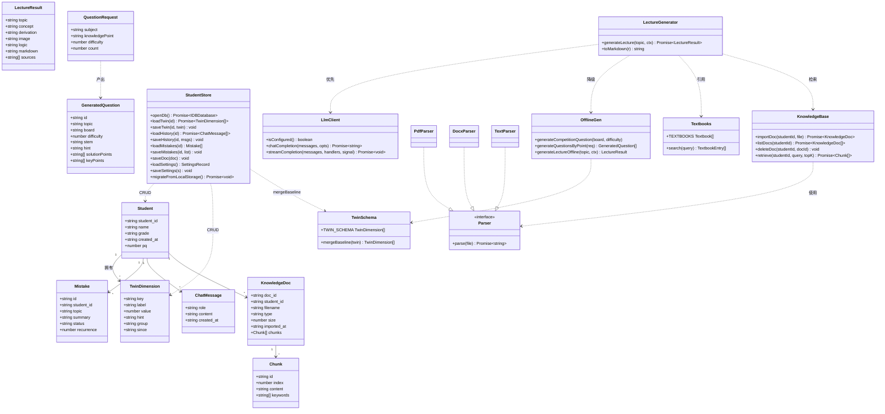
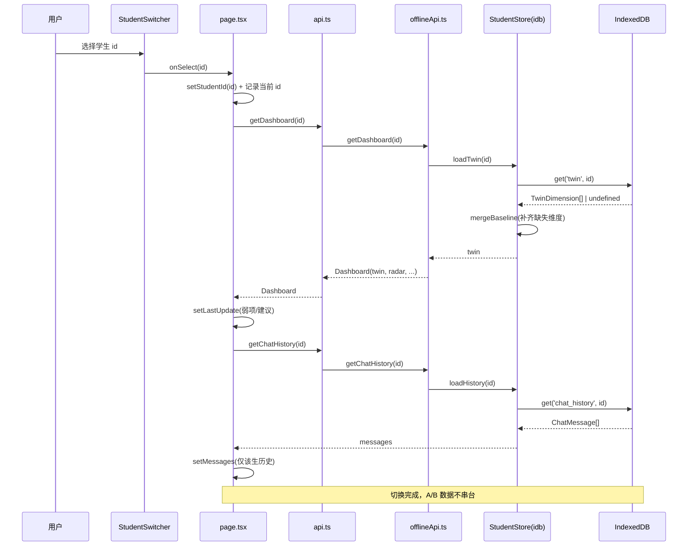
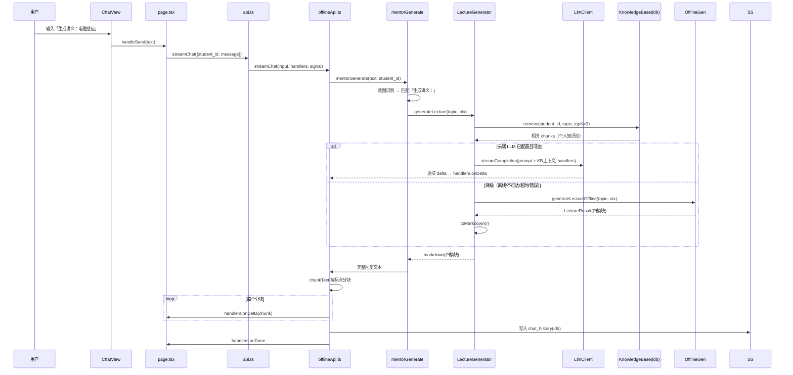
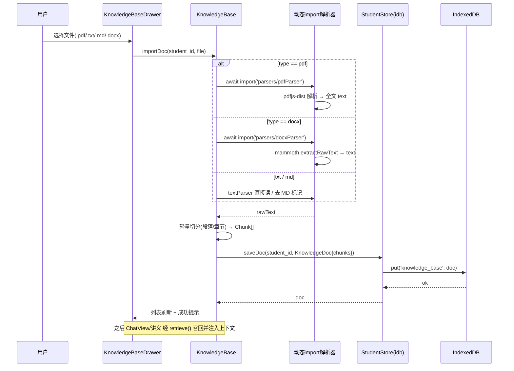
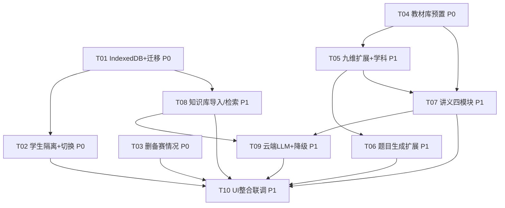

# POMOS 增强需求 · 系统架构与任务分解

> 文档版本：v1.0 · 日期：2026-07-19
> 作者：架构师 高见远（Gao）
> 关联输入：`docs/prd-enhancement-2026-07-19.md` · 技术路线（已确认）· 用户拍板 3 项决策
> 代码基线：前端 `/Users/mac/WorkBuddy/POMOS/pomos-app/frontend`（Next.js 14 + TS + Tailwind + ECharts + KaTeX，静态导出 `output:export`）

---

## 0. 背景与约束重申

本次增强在 **纯前端、GitHub Pages 静态托管、无服务端** 的硬约束下完成。已确认技术路线：

- **持久化**：localStorage → **IndexedDB**，按 `student_id` 隔离（取代 `offlineApi.ts` 的 `KEYS` 命名空间）。
- **智能来源**：联网调用云端 LLM（腾讯混元 Hunyuan，OpenAI 兼容端点）做深度生成；断网/不可达**降级**本地启发式引擎（保留现有 `offlineGen`）。前端预留 LLM 接入点，API key 存浏览器（加密字段）。
- **知识库解析**：轻量切分（段落/章节）+ 关键词检索（纯前端零额外服务）。
- **用户拍板 3 项**：
  1. 教材库深度 = **知识点级 + 典型例题**（7 部教材按章节结构化核心知识点 + 每章 2–3 道代表性例题含解析），预置为前端可检索知识源。
  2. 导入格式 = **.txt/.md/.pdf/.docx 全格式**（引入 `pdfjs-dist` 解析 PDF、`mammoth` 解析 docx；txt/md 直接读）。
  3. 九维孪生 = **扩展维度涵盖新学科**（高数/矢量分析/线性代数/理论力学/电动力学），雷达图随之调整，需处理与历史 `twin` 数据的兼容。

> 接口契约原则：`lib/api.ts` 的**既有导出函数签名保持不变**（现有调用方 `page.tsx`、`useDashboard`、`SettingsPanel` 等不应因重构而改写），新增能力以**增量函数/类型**追加；`offlineApi.ts` 内部把 `lsGet/lsSet` 切换到 IndexedDB 封装，对外表现一致。

---

## 1. 实现方案 + 框架选型

### 1.1 整体分层

采用清晰的 5 层分层，层间单向依赖，确保「数据隔离」「离线优先」「可降级」三原则落地：

```
┌──────────────────────────────────────────────────────────────┐
│ UI 层 (components/views · components/layout · components/knowledge) │
│  OverviewView / TwinView / ChatView / StudentSwitcher / KnowledgeBaseDrawer │
├──────────────────────────────────────────────────────────────┤
│ 生成引擎层 (lib/offlineGen.ts · lib/lecture.ts · lib/llm.ts)      │
│  题目/训练/讲义生成；云端 LLM 调用 + 本地降级编排                    │
├──────────────────────────────────────────────────────────────┤
│ 知识源层 (lib/textbooks.ts · lib/physicsKB.ts · lib/knowledgeBase.ts)│
│  内置教材库 + 学科枚举 + 个人知识库（导入/解析/检索）                │
├──────────────────────────────────────────────────────────────┤
│ 学生隔离层 (lib/studentStore.ts · lib/twinSchema.ts)             │
│  按 student_id 读写 twin/history/mistakes/kb/settings；维度合并兼容 │
├──────────────────────────────────────────────────────────────┤
│ 数据持久层 (lib/db/idb.ts · lib/db/schema.ts · lib/migrateLocalStorage.ts)│
│  IndexedDB 封装 + 对象仓库 schema + localStorage→IDB 一次性迁移      │
└──────────────────────────────────────────────────────────────┘
```

**为何这样分层**：

- **持久层与隔离层分离**：IndexedDB 是底层 K/V+索引引擎，封装成 `studentStore` 后，上层只看到「按学生读写某类数据」，无需关心 store 名/keyPath/事务。学生隔离的边界在 `studentStore` 一处定义，杜绝散落各处的 `localStorage` 拼接 key（当前 `offlineApi.ts` 的 `KEYS_*` 即此反模式）。
- **知识源层独立**：内置教材库（静态、随包）与个人知识库（动态、按生隔离、含解析）性质不同，分开后教材库可随包直接检索，个人知识库走导入流水线。
- **生成引擎层统一降级出口**：`lib/llm.ts` 是唯一联网出口，`offlineGen`/`lecture` 通过它拿深度内容；一旦降级，整条链路回退本地，UI 无感知差异。
- **UI 层数据驱动**：TwinView 的雷达/卡片、Overview 的卡片全部由 `twin` 数组动态渲染，新增学科维度时 UI 自动适配，无需逐文件改硬编码。

### 1.2 框架选型与依赖新增

| 能力 | 选型 | 说明 |
|------|------|------|
| 持久化 | **IndexedDB（原生）+ 轻封装** | 不引第三方 ORM（idb 库亦可，但原生足够，省包体）。封装在 `lib/db/idb.ts`。 |
| PDF 解析 | **pdfjs-dist** | 纯前端唯一可行方案；**动态 import 懒加载**，避免首载体积膨胀。 |
| DOCX 解析 | **mammoth** | 提取 docx 纯文本；**动态 import 懒加载**。 |
| 云端 LLM | **fetch + OpenAI 兼容 /chat/completions** | 混元提供兼容端点 `https://api.hunyuan.cloud.tencent.com/v1`，无需专用 SDK。 |
| API key 加密 | **Web Crypto API（AES-GCM）** | 浏览器内置，零依赖；设备密钥存 IndexedDB `meta`。 |
| 讲义/对话渲染 | 沿用 **react-markdown + react-katex** | 复用现有 Markdown+KaTeX 管线（PRD 4.4）。 |
| 雷达图 | 沿用 **echarts-for-react** | 新增 `TwinRadar` 动态渲染 `twin` 数组。 |

### 1.3 包体优化（pdf.js / mammoth 懒加载）

`pdfjs-dist`（~1.1MB）+ `mammoth`（~430KB）若进主包会显著拖慢首屏。**策略**：

- 解析器文件（pdfParser/docxParser）仅在用户**实际导入对应格式**时才 `await import(...)` 加载，打包器自动将其拆为独立 chunk。
- `textParser`（txt/md）逻辑极轻，可常驻或同样按需。
- 主包不含任何解析器，首屏体积基本不变（仅 Evergreen 代码）。
- 在 `next.config.mjs` 中确认 `output:export` + 动态 import 兼容（Next 14 静态导出支持 `await import` 代码分割，无需特殊配置）。

### 1.4 静态导出约束下的关键决策

- **无服务端能力**：所有解析、检索、生成、持久化皆在浏览器内；LLM 调用是**浏览器直连混元 API**（CORS 需混元端点允许；若混元不支持浏览器 CORS，则本期只能走「用户自建兼容代理」或降级——见 §8 待明确事项 #2）。
- **pdf.js worker 路径**：见 §8 待明确事项 #3，需在 `public/` 放置 worker 并以 `${basePath}/pdf.worker.min.mjs` 注入 `GlobalWorkerOptions.workerSrc`。
- **降级触发条件**（共享约定，见 §7）：未配置 key / `navigator.onLine===false` / fetch 非 2xx / 超时（AbortController 8s）/ 抛错 → 立即回退 `offlineGen`。

---

## 2. 文件列表及相对路径（新增 / 修改）

> 路径相对 `frontend/`。「新」= 新增，「改」= 修改现有。

### 新增文件

| 路径 | 职责 |
|------|------|
| `lib/db/idb.ts` | IndexedDB 底层封装：`openDb()`、`get/put/getAll/delete`、按 store+key 的泛型 CRUD、事务安全。 |
| `lib/db/schema.ts` | 对象仓库 schema 定义：DB 名、版本号、各 store 的 `name/keyPath/indexes` 常量与升级逻辑。 |
| `lib/studentStore.ts` | 学生隔离数据访问层：按 `student_id` 读写 twin/history/mistakes/knowledge_base/settings；`migrateFromLocalStorage()`；`loadTwin` 调用 `mergeBaseline` 兼容历史数据。 |
| `lib/migrateLocalStorage.ts` | localStorage→IndexedDB 一次性迁移：检测旧 `pomos_offline_*` 键，迁移后清理；失败兜底保留 localStorage 副本并置 `meta.migration_failed`。 |
| `lib/twinSchema.ts` | 版本化九维 twin 维度注册表（9 认知维度 + 5 新学科维度，含 `group/since`）；`mergeBaseline(twin)` 向后兼容合并。 |
| `lib/textbooks.ts` | 7 部教材结构化预置知识源：按章核心知识点 + 每章 2–3 道典型例题（题干/解析/出处）。 |
| `lib/textbookRetriever.ts` | 教材检索：`searchTextbooks(query)` 按学科/知识点关键词定位条目，供题目/讲义引用。 |
| `lib/knowledgeBase.ts` | 个人知识库：文档导入（路由解析器）、轻量切分、按 `student_id` 存 IndexedDB、`retrieve(studentId, query, topK)` 关键词召回。 |
| `lib/parsers/pdfParser.ts` | PDF 解析：`pdfjs-dist` 动态 import，提取全文文本（含 worker 路径处理）。 |
| `lib/parsers/docxParser.ts` | DOCX 解析：`mammoth` 动态 import，提取纯文本。 |
| `lib/parsers/textParser.ts` | TXT/MD 读取：直接读文本，MD 去标记保留正文。 |
| `lib/llm.ts` | 云端 LLM 接入：OpenAI 兼容 `chatCompletion`/`streamCompletion`；超时/错误降级回调；`isConfigured()`。 |
| `lib/lecture.ts` | 讲义四模块生成：`generateLecture(topic, ctx)` 编排 LLM 或本地启发式，返回 `LectureResult`；`toMarkdown()` 组装四模块 Markdown。 |
| `components/dashboard/TwinRadar.tsx` | 动态九维/扩展维度雷达（ECharts），随 `twin` 维度数自动调整轴数。 |
| `components/knowledge/KnowledgeBaseDrawer.tsx` | 个人知识库抽屉：导入按钮（accept pdf/txt/md/docx）、已导入列表、删除、检索预览。 |

### 修改文件

| 路径 | 改动要点 |
|------|----------|
| `lib/offlineApi.ts` | 用 `studentStore` 替换 `lsGet/lsSet`（twin/history/mistakes/students/settings）；`streamChat` 先试 LLM 再降级；`mentorGenerate` 增加「生成讲义：」意图识别；`getDashboard` 经 `studentStore` 读 twin；删除 `SAMPLE_READINESS` 相关渲染依赖（保留 `computeReadiness` 内部函数）。 |
| `lib/offlineGen.ts` | 题目生成支持「按学科+知识点+难度 1–5 梯度」（新增 `generateQuestionsByPoint`）；`DIM_WEIGHT`/`BOARD_WEIGHT` 扩新学科；新增 `generateLectureOffline(topic, ctx)` 返回四模块。 |
| `lib/physicsKB.ts` | `KG_BOARDS` 扩为 10 学科（加 高数/矢量分析/线性代数/理论力学/电动力学）；`findBoardByKeyword` 扩关键词；`PHYSICS_BANK` 增 5 学科种子题；知识点节点结构扩展。 |
| `lib/api.ts` | 新增 `generateLecture`/`LectureResult` 类型与导出；`SettingsResponse` 增 LLM 字段（已有 `llm_*` 沿用）；既有导出签名不变。 |
| `lib/pomosData.ts` | `NINE_DIMS` 标注 `group/since`；移除 `SAMPLE_READINESS`（或保留仅供测试）。 |
| `app/page.tsx` | 学生加载改为 `await`（异步 IndexedDB）；切换/创建/删除经 `studentStore`；新增「打开知识库抽屉」状态与回调；删除备赛就绪度相关读取。 |
| `components/layout/StudentSwitcher.tsx` | 旁加「📚 知识库」按钮，触发打开抽屉（传入当前 `student_id`）。 |
| `components/views/OverviewView.tsx` | 移除「备赛就绪度」卡片（ReadinessGauge 引用 + 三档概率行）；其余卡片 Grid 自动上移；不再读 `readiness`。 |
| `components/dashboard/ReadinessGauge.tsx` | 删除（不再引用）。 |
| `components/views/TwinView.tsx` | 渲染 `twin` 动态维度；接入 `TwinRadar`；新增学科维度自动展示。 |
| `components/views/ChatView.tsx` | 竞赛模式提示补充「生成讲义：<知识点>」；讲义 Markdown 渲染复用现有管线。 |
| `components/settings/SettingsPanel.tsx` | API key 保存改为经 `studentStore` 加密存 IndexedDB（而非 localStorage 明文）；增加「测试连接」走 `lib/llm` 真实探测。 |

---

## 3. 数据结构与接口（类图 / Mermaid）

### 3.1 IndexedDB 对象仓库 schema（`lib/db/schema.ts`）

| store | keyPath | index | 说明 |
|-------|---------|-------|------|
| `students` | `student_id` | — | 学生列表（`Student`） |
| `twin` | `student_id` | — | 九维（含学科扩展）画像 `TwinDimension[]` |
| `mistakes` | `id` | `student_id` | 错题 `Mistake`（按生隔离） |
| `chat_history` | `student_id` | — | 该生对话 `ChatMessage[]` |
| `knowledge_base` | `doc_id` | `student_id` | 个人知识库文档 `KnowledgeDoc` |
| `settings` | `key`（固定 `'global'`） | — | LLM 配置 + 加密 key（`encryptedLlmKey`） |
| `meta` | `key` | — | 迁移标记 `migration_done`、设备密钥 `deviceKey`、schema 版本 |

> DB 名 `pomos_idb`，初始版本 `1`；未来升级走 `onupgradeneeded`（见 §7）。

### 3.2 类图



### 3.3 关键接口签名（设计态 TS 类型）

```ts
// lib/twinSchema.ts —— 扩展维度注册表
export type TwinGroup = "cognitive" | "subject";
export interface TwinDimension {
  key: string; label: string; value: number; hint: string;
  group?: TwinGroup; since?: string; // "v1" 认知九维 / "v2" 新学科维度
}
export const TWIN_SCHEMA: TwinDimension[];          // 9 认知 + 5 学科
export function mergeBaseline(twin: TwinDimension[]): TwinDimension[];

// lib/lecture.ts —— 讲义四模块
export const LECTURE_SECTIONS = ["概念辨析", "数理推导", "图像分析", "逻辑贯通"] as const;
export interface LectureContext { studentId: string; knowledgePoint?: string; board?: string; }
export interface LectureResult {
  topic: string;
  concept: string; derivation: string; image: string; logic: string;
  markdown: string; sources: string[];   // 引用教材/KB 出处
}
export function generateLecture(topic: string, ctx: LectureContext): Promise<LectureResult>;
export function toMarkdown(r: LectureResult): string;

// lib/llm.ts —— 云端 LLM（OpenAI 兼容）
export interface LlmOpts { baseUrl: string; apiKey: string; model: string; temperature?: number; maxTokens?: number; }
export interface LlmClient {
  isConfigured(): boolean;
  chatCompletion(messages: {role:string;content:string}[], opts: LlmOpts): Promise<string>;
  streamCompletion(messages: {role:string;content:string}[], handlers: StreamHandlers, signal?: AbortSignal, opts?: LlmOpts): Promise<void>;
}

// lib/knowledgeBase.ts —— 个人知识库
export type DocType = "pdf" | "txt" | "md" | "docx";
export interface KnowledgeDoc { doc_id: string; student_id: string; filename: string; type: DocType; size: number; imported_at: string; chunks: Chunk[]; }
export interface Chunk { id: string; index: number; content: string; keywords: string[]; }
export function importDoc(studentId: string, file: File): Promise<KnowledgeDoc>;
export function retrieve(studentId: string, query: string, topK?: number): Promise<Chunk[]>;

// lib/offlineGen.ts —— 题目按知识点+梯度
export interface QuestionRequest { subject: string; knowledgePoint?: string; difficulty: number; count?: number; }
export function generateQuestionsByPoint(req: QuestionRequest): GeneratedQuestion[];
```

---

## 4. 程序调用流程（时序图 / Mermaid）

### 4.1 切换学生加载其隔离数据



### 4.2 生成四模块讲义（含 LLM 调用 / 降级分支）



### 4.3 导入文档 → 解析 → 切分 → 存 IndexedDB → 可检索



---

## 5. 有序任务列表（含依赖关系）

> 建议顺序遵循团队确认；`P0` = 基础架构必须，`P1` = 核心体验。每条含：任务 ID / 依赖 / 涉及文件 / 验收标准。

| 任务 ID | 任务名 | 优先级 | 依赖 | 涉及文件 | 验收标准 |
|---------|--------|--------|------|----------|----------|
| **T01** | IndexedDB 持久化封装 + 迁移脚本 | P0 | — | `lib/db/idb.ts`(新)、`lib/db/schema.ts`(新)、`lib/studentStore.ts`(新)、`lib/migrateLocalStorage.ts`(新) | 打开 DB v1 并提供类型安全 CRUD；首次启动检测 localStorage 旧数据并迁移至 IndexedDB、成功后清理；刷新/重开数据不丢；大文本（教材全文）可存不触发配额。 |
| **T02** | 学生数据隔离 + 切换改造 | P0 | T01 | `lib/offlineApi.ts`(改)、`lib/api.ts`(改)、`app/page.tsx`(改)、`components/layout/StudentSwitcher.tsx`(改) | 新建 A、B 两生；A 做题/对话后切到 B，B 的 twin/bug/对话均为空基线；删除 A 后其数据彻底清除且不影响 B；对话历史严格按 `student_id` 隔离。 |
| **T03** | 删除「备赛情况」栏 | P0 | — | `components/views/OverviewView.tsx`(改)、`components/dashboard/ReadinessGauge.tsx`(删)、`lib/pomosData.ts`(改)、`lib/api.ts`(改) | Overview 页面不再出现「省一 / 省队 / IPhO」任何字样与图表；其余卡片 Grid 自动上移填补；无残留引用、编译通过。 |
| **T04** | 教材库预置（结构化） | P0 | — | `lib/textbooks.ts`(新)、`lib/textbookRetriever.ts`(新) | 7 部教材按章节结构化（核心知识点 + 每章 2–3 例题含解析/出处）；`searchTextbooks(query)` 可按学科/知识点返回条目；被讲义/题目引用。 |
| **T05** | 九维扩展 + 学科枚举 | P1 | T04 | `lib/physicsKB.ts`(改)、`lib/twinSchema.ts`(新)、`lib/pomosData.ts`(改)、`components/views/TwinView.tsx`(改)、`components/dashboard/TwinRadar.tsx`(新)、`lib/offlineGen.ts`(改) | 选题器出现新学科（高数/矢量分析/线性代数/理论力学/电动力学）；TwinView 雷达/卡片随维度数调整；历史 9 维 twin 加载时自动补齐新学科基线不报错；新学科可出题。 |
| **T06** | 题目生成扩展（学科/知识点/梯度） | P1 | T05 | `lib/offlineGen.ts`(改)、`lib/physicsKB.ts`(改) | 按具体知识点（如「刚体转动·平行轴定理」）定向出题 ≥3 道梯度题并附阶梯提示；难度 1–5 ★ 档位；新学科术语/符号符合规范（如电动力学用矢量微积分记法）。 |
| **T07** | 讲义四模块 | P1 | T04, T05 | `lib/lecture.ts`(新)、`lib/offlineApi.ts`(改)、`components/views/ChatView.tsx`(改)、`lib/api.ts`(改) | 输入「生成讲义：xxx」返回 Markdown，含 4 个 H2（概念辨析/数理推导/图像分析/逻辑贯通）且内容非空；可引用教材与 KB；联网走 LLM、断网降级本地。 |
| **T08** | 知识库导入 / 解析 / 检索 | P1 | T01 | `lib/knowledgeBase.ts`(新)、`lib/parsers/pdfParser.ts`(新)、`lib/parsers/docxParser.ts`(新)、`lib/parsers/textParser.ts`(新)、`components/knowledge/KnowledgeBaseDrawer.tsx`(新)、`components/layout/StudentSwitcher.tsx`(改)、`app/page.tsx`(改) | 导入 pdf/txt/md/docx → 解析→切分→存该生 IndexedDB；列表可查看/删除；检索为关键词匹配、零外部依赖，并可被对话/讲义注入为参考片段。 |
| **T09** | 云端 LLM 接入 + 降级 | P1 | T07, T08 | `lib/llm.ts`(新)、`lib/offlineApi.ts`(改)、`components/settings/SettingsPanel.tsx`(改)、`lib/api.ts`(改)、`lib/studentStore.ts`(改) | 配置混元 key 后生成内容显著更深；拔网/错误 key 自动回退本地不抛错、不卡死；API key 以 AES-GCM 加密存 IndexedDB（非明文 localStorage）。 |
| **T10** | UI 整合与端到端联调 | P1 | T02–T09 | `components/views/OverviewView.tsx`、`TwinView.tsx`、`ChatView.tsx`、`components/layout/Topbar.tsx`、`StudentSwitcher.tsx`、`app/page.tsx`、`lib/api.ts`、`lib/offlineApi.ts` | 端到端：新建学生→导入 KB→生成讲义/题目→切换不串台→刷新不丢；离线降级可用；删除备赛情况生效；构建静态导出成功并通过 `npm run typecheck`。 |

### 任务依赖图



---

## 6. 依赖包列表

| 包 | 版本建议 | 用途 | 加载策略 |
|----|----------|------|----------|
| `pdfjs-dist` | `^4.7.76` | PDF 文本解析 | **动态 import 懒加载**（仅导入 PDF 时加载，独立 chunk） |
| `mammoth` | `^1.8.0` | DOCX 纯文本提取 | **动态 import 懒加载**（仅导入 DOCX 时加载，独立 chunk） |
| （内置）Web Crypto `crypto.subtle` | — | API key AES-GCM 加密 | 浏览器原生，零依赖 |
| （已有）echarts / echarts-for-react | `5.5.1` | 雷达图（`TwinRadar`） | 沿用 |
| （已有）react-markdown / react-katex | `9.0.1` / `3.0.1` | 讲义/对话 Markdown+公式渲染 | 沿用 |

**首载体积控制**：主包不引入 `pdfjs-dist`/`mammoth`；二者仅在 `KnowledgeBaseDrawer` 实际触发导入对应格式时才 `await import()`，由打包器自动分割成按需 chunk，GitHub Pages 下首屏不下载解析器。

---

## 7. 共享知识（跨文件约定）

- **`student_id` 命名与隔离**：格式 `stu_` + `Math.random().toString(36).slice(2,10)`；所有按生数据（twin/history/mistakes/knowledge_base）读写一律经 `studentStore`，禁止在 UI 层直接拼 localStorage/IndexedDB key。隔离边界只在 `studentStore` 一处。
- **IndexedDB 版本与迁移**：DB 名 `pomos_idb`，初始 `version = 1`；升级统一在 `schema.ts` 的 `onupgradeneeded` 中按旧版本号增量建 store/索引。`meta.migration_done` 标记首次 localStorage→IDB 迁移；`meta.migration_failed` 兜底（保留 localStorage 副本并提示）。
- **LLM endpoint / key 存储**：沿用 `SettingsResponse.llm_provider / llm_base_url / llm_api_key / llm_model`；实际密钥以 `encryptedLlmKey` 字段 AES-GCM 加密后存 `settings` store（`key='global'`），**绝不**存明文 localStorage。默认混元兼容端点 `https://api.hunyuan.cloud.tencent.com/v1`；支持任意 OpenAI 兼容（自定义 base_url）。
- **讲义四模块固定标题常量**：`LECTURE_SECTIONS = ["概念辨析","数理推导","图像分析","逻辑贯通"]`（`lib/lecture.ts`），全链路以此生成与渲染二级标题，禁止硬编码散落。
- **学科枚举与知识点分类体系**：`KG_BOARDS` 扩为 10 学科；知识点三级体系 `(subject → chapter → point)`，教材库与个人知识库均按此组织，便于检索命中。
- **降级触发条件**（统一在 `lib/llm.ts` 与 `offlineApi.streamChat`）：`!isConfigured()` / `navigator.onLine === false` / fetch 非 2xx / 超时（AbortController 8s）/ 抛错 → 立即回退 `offlineGen`/`generateLectureOffline`，UI 无感。降级时 `streamChat` 仍走既有「按标点 chunk + `handlers.onDelta`」管线，保证 `StreamHandlers` 契约不变。
- **接口契约**：`lib/api.ts` 既有导出函数签名（如 `streamChat`、`getDashboard`、`getChatHistory`）保持不变；新增能力（讲义/LLM/KB）以增量函数与类型追加，避免牵连现有调用方。

---

## 8. 待明确事项（架构层面仍需确认）

1. **九维扩展后历史 twin 兼容/重置策略**：本设计采用 `mergeBaseline` 自动补齐新学科基线（值取 0.5，**不破坏、不重置**历史 9 维数据）。需确认是否还要给用户提供「重置画像」入口，或允许新学科维度在首次相关出题时再惰性初始化。
2. **LLM 流式与现有 SSE 离线引擎衔接**：离线引擎按标点 chunk；混元走 OpenAI SSE，`streamCompletion` 已统一为 `handlers.onDelta`。需确认：① 混元兼容端点是否支持浏览器直连（CORS）——若不支持，纯前端只能降级或要求用户自建兼容代理；② `AbortSignal` 取消在 fetch 长流上的行为需在真机验证。
3. **pdf.js worker 在静态导出下的路径**：`output:export` + `basePath`（GitHub Pages 子路径 `/pomos/`）。`pdf.worker.min.mjs` 需置于 `public/` 并由构建复制到 `out/`，运行时以 `GlobalWorkerOptions.workerSrc = ${basePath}/pdf.worker.min.mjs` 注入（建议用 `pdfjs-dist/legacy/build` 以兼容静态托管）。需确认构建步骤能正确复制 worker 且带 `basePath` 前缀。
4. **纯前端 API key 安全性边界**：AES-GCM + 设备密钥（存 `meta`）仅防「 casual 窥探」（DevTools 直接看明文），无法防有设备物理/登录访问权限者。是否可接受？或改为「每次会话输入 key、不持久化」？需产品定调。
5. **Overview 的 PQ 雷达（6 维）是否也纳入新学科**：本设计仅 `TwinView` 的 `TwinRadar` 随维度扩展调整；Overview 的 `PqRadar`（6 维 PQ 投影）保持原样。是否要把学科维度并入 PQ/就绪度推导（扩 `DIM_WEIGHT`）？建议本期不并入，避免与「竞赛就绪度」语义混淆（且备赛情况已删除）。
6. **教材库预置数据体量**：7 部教材全量结构化（知识点 + 例题）可能数百 KB。本期随 `textbooks.ts` 静态打包（开箱即用、非用户导入），检索按需。需确认前端包体预算是否接受，或改为首屏后懒加载该模块。
7. **DOCX 导入的公式/图片**：`mammoth` 仅提取文本，MathType/OLE 公式与图片会丢失。本期仅文本，公式后续可用 KaTeX/图片 OCR 补。需确认是否本期必须保留公式（若必须，需额外方案，或限制导入为 txt/md/pdf 文本层）。

---

> 设计原则落地说明：本架构以「数据隔离 + 离线优先 + 可降级」为骨架，所有新增能力（教材库/知识库/LLM/讲义）均以**增量模块**挂载于既有 `offlineApi`/`offlineGen` 之上，既满足 GitHub Pages 纯静态约束，又保证 `api.ts` 既有契约零破坏、工程师可按 T01→T10 顺序独立实现与验收。
