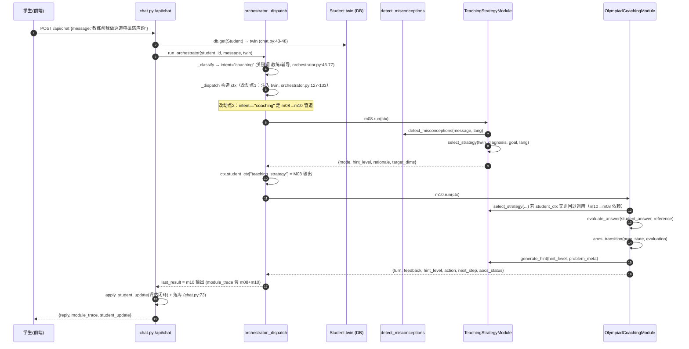
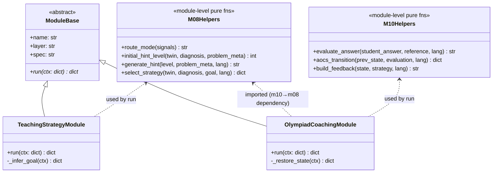

# POMOS m08 / m10 纯规则实装架构设计

> 范围：仅 Teaching 层两个模块（m08 教学策略引擎、m10 自适应教练 AOCS）由 stub 升级为**纯 Python 规则/启发式**实装。不接入任何外部 LLM，可被子 Orchestrator 调度，可离线 pytest。
> 不触碰其他模块（m07/m09/m11/m12/m13/m14/m15/m16 等不在本任务范围）。
> 本文档所有结论均基于实际 Read 源码（行号引用见正文），非凭记忆生成。

---

## 0. 现状核实（已 Read 核实）

| 文件 | 关键事实（行号） |
|------|------------------|
| `backend/app/modules/base.py` | `ModuleBase(ABC)`，固定接口 `run(self, ctx: Dict[str, Any]) -> Dict[str, Any]`（`:20-31`）；返回约定 `{"module","action","output":{...},"next":...}`（docstring `:21-30`）。`name/layer/spec` 为类属性。 |
| `backend/app/modules/m08_teaching_strategy.py` | stub：`TeachingStrategyModule`，`run` 硬编码返回 `{"mode":"引导式追问","hint_level":2}`，`next="m09_olympiad_problem"`（`:13-22`）。 |
| `backend/app/modules/m10_olympiad_coaching.py` | stub：`OlympiadCoachingModule`，`run` 硬编码返回 `{"turn":1,"feedback":"先画出受力图..."}`，`next="m11_scientific_inquiry"`（`:13-22`）。 |
| `backend/app/orchestrator.py` | **关键**：`_dispatch` 按 `intent` 派发**单一**主模块（`:120-160`）：构造 `ctx`（`:127-133`，**未含 twin**），`primary.run(ctx)`（`:138`），把 `result["output"]` 并入 `student_ctx`（`:144-145`），**`next` 字段被忽略**。意图映射见 `INTENT_MODULE_MAP`（`:26-43`）、关键词表（`:46-77`）。 |
| `backend/app/modules/assessment_engine.py` | m14 真实样板：`detect_misconceptions(message, lang)`（`:123-135`）返回 `[{dims, note}]`；`heuristic_assess`（`:163-217`）确定性启发式；NINE_DIMS/PQ_WEIGHTS 常量（`:26-42`）。 |
| `backend/app/modules/m04_student_model.py` | 九维 `NINE_DIMS`（`:7-10`）；`run` 从 `ctx["student_ctx"]["twin"]` 取画像（`:20`），说明 twin 期望经 `student_ctx` 传入。 |
| `backend/app/modules/m05_diagnosis.py` | `run` 调用 `detect_misconceptions`（`:9,21`）；无错误概念时按消息关键词推断 PCDF 层（`:23-35`）。 |
| `backend/app/models.py` | `NINE_DIMS`（`:19-29`）、`BOARD_MASTERY_MAP`（`:55-61`）、`Student.twin`(JSON)（`:69-80`）、`Mistake`（`:117-134`）。 |
| `backend/app/config.py` | `settings.coach_language`（`:47`）—— 决定 zh/en。 |
| `backend/tests/conftest.py` | 会话级临时 SQLite + `TestClient`，离线 mock（`:1-4,17-63`）。 |
| `backend/tests/test_assessment.py` | 纯函数单测风格（直接 import 模块函数，无需 fixture）（`:1-55`）。 |

### 0.1 核心结论：当前 m08/m10 与 orchestrator 的真实关系

1. **m08、m10 是「按意图各自独立触发」的**，不是自动串联。一次 `/api/chat` → `_classify` 取一个 intent → `_dispatch` 只调一个主模块（`orchestrator.py:120-160`）。stub 里的 `next` 字段是**死代码**，编排器从不读取。
2. **twin 当前传不到 m08/m10**：`run_orchestrator` 把 DB 的 `Student.twin` 放入 `state["twin"]`（`chat.py:48,53` → `orchestrator.py:278`），但 `_dispatch` 构造 `ctx` 时**没有把 twin 放进 ctx**（`orchestrator.py:127-133`）。因此 m08/m10 想用九维画像，必须先改 orchestrator 注入 twin。
3. **诊断信息**：`intent==coaching/strategy` 时 m05 不运行，但 m08/m10 可直接 `from app.modules.assessment_engine import detect_misconceptions` 复用 m05 同款函数（与 `m05_diagnosis.py:9` 完全一致），无需 orchestrator 额外调度。

---

## 1. 实现方案与框架选型

- **语言/框架**：纯 Python 3.11+，继承 `ModuleBase`，复用现有 `SQLAlchemy` session / `settings` / `detect_misconceptions`，**不引入任何新依赖**（依赖包列表见 §7，预期为空）。
- **能力边界（规则版）**：
  - **m08（教学策略引擎）**：给定「学生状态（九维 twin + m05 诊断） + 当前目标（goal）」，用**决策表**路由出六教学模式之一 + 初始五级 Hint 等级，并返回策略理由。它**只做决策，不生成自然语言长文**（长文仍由 orchestrator 的 `_assemble`/离线教练负责，与本任务解耦）。
  - **m10（AOCS 自适应教练）**：围绕**单题多轮**引导的**状态机**。输入 m08 给出的策略 + 学生本轮作答，输出结构化反馈 `{turn, feedback, hint_level, action, next_step, aocs_status}`。它**评估作答、推进 hint_level、决定下一步动作（追问/给提示/讲解/换题）**，在收敛条件满足时结束本轮教练。
- **m08→m10 依赖关系**：m10 的每一步都**依赖 m08 产出的 `teaching_strategy`**。实现上 m10 直接 `from app.modules.m08_teaching_strategy import select_strategy, generate_hint`（库函数复用），保证 m10 始终拿到与 m08 同源的策略；orchestrator 侧也显式先跑 m08 再跑 m10（见 §3 接入点 2）。

---

## 2. 文件列表（相对路径）

| 文件 | 作用 | 改动类型 |
|------|------|----------|
| `backend/app/modules/m08_teaching_strategy.py` | 重写 stub：六模式路由 + 五级 Hint 生成器 + `run` 装配 | 改写 |
| `backend/app/modules/m10_olympiad_coaching.py` | 重写 stub：AOCS 状态机 + `run` 装配（import m08 函数） | 改写 |
| `backend/app/orchestrator.py` | 接入改动点 1（ctx 注入 twin）+ 接入点 2（coaching 意图走 m08→m10 管道） | 小改 |
| `backend/tests/test_m08_teaching_strategy.py` | m08 纯函数 + 集成单测 | 新增 |
| `backend/tests/test_m10_olympiad_coaching.py` | m10 纯函数（含 AOCS 收敛）+ 集成单测 | 新增 |

> 说明：决策表 / Hint 模板 / 状态机转移规则全部内聚在 **m08 / m10 两个模块文件内**（与 `assessment_engine.py` 单文件聚合风格一致），不新增独立常量包，避免过度抽象。

---

## 3. 核心类 / 函数签名

所有模块类继承 `ModuleBase`，`run` 签名严格保持 `run(self, ctx: dict) -> dict`（与 `base.py:20-31` 一致）。可单测的**规则逻辑抽成模块级纯函数**，与 `run` 解耦（对齐 `assessment_engine.heuristic_assess` 的设计）。

### 3.1 m08 `TeachingStrategyModule`

```python
# backend/app/modules/m08_teaching_strategy.py
from app.modules.base import ModuleBase
from app.modules.assessment_engine import detect_misconceptions
from app.config import settings

# ---- 模块级纯函数（可单测，无 ctx 依赖） ----

def route_mode(signals: dict) -> str:
    """六模式决策表。
    signals = {
      "has_misconception": bool,
      "weak_dims": list[str],          # twin 低于阈值的维度
      "goal_type": str,               # learn_new|consolidate|apply|review|extend
      "recent_practice": bool,        # 近期是否练过（来自 memory/student_ctx，可选）
      "avg_mastery": float,           # 九维均值 0~1
    }
    返回: "讲授"|"探究"|"支架"|"对练"|"复盘"|"拓展"
    """

def initial_hint_level(twin: dict, diagnosis: list, problem_meta: dict | None) -> int:
    """返回 1~5 的初始 Hint 等级。
    规则：难度越高/掌握度越低 → 起始等级越高（更喂提示）；
    有顽固错误概念 → +1 级（更多支架）。
    problem_meta = {"board": str, "difficulty": 1~5, "topic": str} 或 None。
    """

def generate_hint(level: int, problem_meta: dict | None, lang: str = "zh") -> str:
    """五级 Hint 文本生成器（纯规则模板，不调 LLM）。
    level1 方向性提示 / level2 思路框架 / level3 关键步骤 / level4 近乎完整推导 / level5 答案。
    problem_meta 用于按板块/难度选模板；缺失时用通用模板。
    """

def select_strategy(twin: dict, diagnosis: list, goal: dict | None, lang: str = "zh") -> dict:
    """策略决策主入口（m10 也直接调用本函数）。
    返回 strategy dict:
    {
      "mode": str,                 # 六模式之一
      "hint_level": int,           # 1~5 初始等级
      "rationale": str,            # 决策理由（中文/英文，供可解释）
      "target_dims": list[str],    # 重点针对的九维
      "scaffolding": str|None,     # 讲授模式下的类比/支架提示（可选）
    }
    """

class TeachingStrategyModule(ModuleBase):
    name = "m08_teaching_strategy"
    layer = "Teaching"
    spec = "08_Teaching_Strategy_Engine"

    def run(self, ctx: dict) -> dict:
        """装配函数：从 ctx 取 twin/diagnosis/goal → select_strategy → 标准返回。
        - twin 来源：ctx["twin"]（接入点1 注入）或 ctx["student_ctx"]["twin"] 或 全 0 默认。
        - diagnosis 来源：detect_misconceptions(ctx["message"], lang)。
        - goal 来源：_infer_goal(ctx)（由 message 关键词推断 goal_type）。
        返回 {"module","action":"select_strategy",
              "output":{"mode","hint_level","rationale","target_dims","scaffolding"},
              "next":"m09_olympiad_problem"}
        """

    def _infer_goal(self, ctx: dict) -> dict:
        """从 message/student_ctx 推断 goal_type 与 problem_meta（防御式，缺省 learn_new）。"""
```

### 3.2 m10 `OlympiadCoachingModule`

```python
# backend/app/modules/m10_olympiad_coaching.py
from app.modules.base import ModuleBase
from app.modules.m08_teaching_strategy import select_strategy, generate_hint  # m10→m08 依赖
from app.modules.assessment_ import detect_misconceptions   # 复用 m05 诊断
from app.config import settings

# ---- 模块级纯函数（可单测） ----

def evaluate_answer(student_answer: str, reference: dict | None, lang: str = "zh") -> str:
    """规则评估本轮作答：返回 "correct" | "partial" | "wrong"。
    - reference = {"key_steps":[str], "answer_keywords":[str]} 或 None。
    - correct: 命中全部 key_steps/关键词；wrong: 命中极少或含自相矛盾；partial: 居中。
    - reference 为 None（无题面元信息）→ 默认 "partial"，交由追问澄清。
    """

def aocs_transition(prev_state: dict, evaluation: str, lang: str = "zh") -> dict:
    """AOCS 状态机转移（核心可单测函数）。
    prev_state = {"turn":int, "hint_level":int, "streak_correct":int,
                  "status":"DIAGNOSE|GUIDE|FEEDBACK|REINFORCE|DONE"}
    返回新 state + 本轮动作决策:
    {
      "turn": int, "hint_level": int, "streak_correct": int, "status": str,
      "action": "追问"|"给提示"|"讲解"|"换题"|"复盘总结",
      "next_step": str, "feedback": str, "done": bool,
    }
    收敛规则：
      - evaluation=="correct": streak_correct+=1；streak_correct>=2 → status=DONE, action=复盘总结。
      - evaluation=="partial": 停留；action=追问（必要时 hint_level+0）；next_step 依策略。
      - evaluation=="wrong":  streak_correct=0；hint_level=min(5,+1)；
            hint_level<5 → action=给提示（升级提示）；
            hint_level==5 仍错 → action=讲解, status=DONE（转讲解/记录错题）。
    """

def build_feedback(state: dict, strategy: dict, lang: str = "zh") -> str:
    """按 action + hint_level 拼装反馈文本；action==给提示 时调用 m08.generate_hint。"""

class OlympiadCoachingModule(ModuleBase):
    name = "m10_olympiad_coaching"
    layer = "Teaching"
    spec = "10_Adaptive_Olympiad_Coaching_System"

    def run(self, ctx: dict) -> dict:
        """装配函数：
        1) strategy = ctx["student_ctx"].get("teaching_strategy")
                      or select_strategy(twin, diagnosis, goal, lang)   # m10→m08 回退依赖
        2) prev_state = ctx["student_ctx"].get("aocs_state")
                      or {"turn":0,"hint_level":strategy["hint_level"],"streak_correct":0,"status":"DIAGNOSE"}
        3) evaluation = evaluate_answer(ctx.get("student_answer"), ctx.get("reference"), lang)
        4) out = aocs_transition(prev_state, evaluation, lang)
        5) out["feedback"] = build_feedback(out, strategy, lang)
        返回 {"module","action":"coach",
              "output":{"turn","feedback","hint_level","action","next_step",
                        "aocs_status","strategy_ref":strategy["mode"]},
              "next":"m11_scientific_inquiry"}
        """

    def _restore_state(self, ctx: dict) -> dict:
        """从 ctx 恢复 AOCS 多轮状态（支持跨轮：由 memory/student_ctx 传入 aocs_state）。"""
```

### 3.3 与 `base.py` 的对应关系

- `m08.run` / `m10.run` 直接实现 `ModuleBase.run`（签名、返回结构完全一致）。
- 所有「重逻辑」下沉到模块级纯函数（`route_mode`/`select_strategy`/`generate_hint`/`evaluate_answer`/`aocs_transition`），`run` 只做「取数 → 调纯函数 → 装配标准 dict」。这样 pytest 可**不依赖 orchestrator / DB / LLM** 直接测纯函数。

---

## 4. m08 六模式 + 五级 Hint 规则（具体，非空泛）

### 4.1 六模式路由决策表（实现于 `route_mode`）

输入信号（由 `select_strategy` 计算）：`has_misconception`、`weak_dims`、`goal_type`、`recent_practice`、`avg_mastery`。
阈值常量（模块内定义，便于单测）：`WEAK_THRESHOLD = 0.5`。

| 优先级 | 触发条件 | 模式 | 附加动作 |
|--------|----------|------|----------|
| 1 | `has_misconception == True`（顽固错误概念） | **讲授** | `scaffolding`=类比提示；初始 hint_level +1（更多支架） |
| 2 | `goal_type=="learn_new"` 且 `("concept" in weak_dims or "modeling" in weak_dims)` | **探究** | 引导学生自己建立图像 |
| 3 | `goal_type=="learn_new"` 且其余弱维 | **支架** | 分步搭脚手架 |
| 4 | `goal_type=="consolidate"` 且 `avg_mastery>=0.6` | **对练** | 多给变式/同型题 |
| 5 | `goal_type=="review"` 或 `recent_practice==True` | **复盘** | 让学生讲思路、找错因 |
| 6 | `goal_type=="extend"` 或 `avg_mastery>=0.75` | **拓展** | 跨情境迁移/压轴 |
| 默认 | 其它 | **支架** | 稳妥渐进 |

`goal_type` 推断（`_infer_goal`，关键词，缺省 `learn_new`）：
`复习/复盘`→review；`拓展/进阶/拔高`→extend；`练/刷题/巩固`→consolidate；`应用/做`→apply；其它→learn_new。`problem_meta` 优先读 `ctx["student_ctx"].get("problem_meta")`（上游 m09 设定，超出本范围但防御读取）。

### 4.2 五级 Hint 生成器（实现于 `generate_hint`）

`initial_hint_level` 公式（1~5 截断）：
```
base = clamp( round( (problem_meta.difficulty or 3) - avg_mastery*4 ), 1, 5 )
if has_misconception: base = min(5, base+1)
```
即「题越难 / 学生越弱 → 起始喂越多提示」。

各级文本（纯模板，可按 `problem_meta.board`/`difficulty` 选更具体模板，缺省通用；多语言由 `lang` 切换）：

- **L1 方向性提示**：`"先判断本题涉及哪个守恒量/定律（能量？动量？角动量？），朝这个方向想。"`
- **L2 思路框架**：`"建议步骤：①受力/场分析 ②选研究对象(整体/隔离) ③列守恒/牛顿方程 ④定边界条件求解。"`
- **L3 关键步骤**：`"对导体棒考虑感应电动势 ε=BLv 与回路电流 I=ε/R，再算安培力。"`（按板块替换关键词）
- **L4 近乎完整推导**：给出公式链与代入式，仅留最终数值计算给学生。
- **L5 答案**：给出完整参考解答要点（规则版即模板化参考答案骨架，非 LLM 生成）。

---

## 5. m10 AOCS 自适应教练状态机（具体规则）

### 5.1 状态与转移（`aocs_transition`）

状态字段：`turn, hint_level, streak_correct, status`。
`status` 取值：`DIAGNOSE`（判定卡点）→ `GUIDE`（按策略+等级出提示）→ `FEEDBACK`（评估本轮）→ `REINFORCE`（错题巩固/进阶）→ `DONE`。

每轮固定推进：`turn += 1`。

| 本轮 evaluation | streak_correct | hint_level 变化 | action | 收敛 |
|-----------------|----------------|------------------|--------|------|
| correct | +1 | 不变 | 若 streak<2 → 追问/进阶小问；若 ≥2 → **复盘总结** | streak≥2 → DONE |
| partial | 不变 | 不变或 +0 | **追问**（澄清思路/要关键式） | 继续 |
| wrong | 归零 | +1（封顶 5） | 若 <5 → **给提示**（升级）；若 ==5 仍错 → **讲解** | level5 仍错 → DONE（转讲解/记录 Mistake） |

`next_step` 文本由 `action` + `strategy["mode"]` 组合（如 探究模式+追问 → "你先说说这道题的物理图像是什么？"）。

### 5.2 结构化反馈产出

`m10.run` 最终 `output`：
```json
{
  "turn": 3,
  "feedback": "（build_feedback 拼装，含 generate_hint 或追问语）",
  "hint_level": 3,
  "action": "给提示",
  "next_step": "对导体棒列 ε=BLv，再算回路电流。",
  "aocs_status": "GUIDE",
  "strategy_ref": "支架"
}
```
`next` 保持 `"m11_scientific_inquiry"`（与 stub 一致，编排器忽略但不破坏契约）。

---

## 6. mermaid 时序图（orchestrator 实装后 m08→m10 调用）



---

## 7. 依赖包列表

**预期为空（不引入任何新依赖）。** 复用既有：`fastapi`、`sqlalchemy`、`pydantic-settings`、`app.config.settings`、`app.modules.assessment_engine.detect_misconceptions`、`app.modules.base.ModuleBase`。全部已在 `backend/requirements.txt` 与 `backend/.venv` 中。

---

## 8. 共享约定

- **统一返回结构**：所有模块 `run` 返回 `{"module":<id>,"action":<str>,"output":{...},"next":<id>}`（与 `base.py:21-30` 契约一致）。新增字段（如 `aocs_status`/`strategy_ref`）只放进 `output`，不破坏外层 schema。
- **错误处理（防御式，模块内兜底）**：orchestrator 对 `primary.run` **没有 try/except**（`orchestrator.py:137-138`），所以模块自身不得抛未捕获异常。缺 ctx 字段时回退默认值（`twin` 缺→全 0；`diagnosis` 缺→空列表；`goal` 缺→learn_new；`aocs_state` 缺→初始状态）；若确实无法产出，返回 `output` 中带 `"degraded": True` 与安全默认，绝不 raise。
- **日志约定**：模块顶部 `logger = logging.getLogger("pomos.module.m08")` / `m10`（与 `main.py:27` 的 `pomos` logger 体系一致），用 `logger.info/warning` 记录策略选择/状态机转移；不在日志打印敏感密钥。
- **多语言**：所有面向学生的文本函数接收 `lang`（取自 `settings.coach_language`，`config.py:47`），zh/en 双模板。
- **可测试性**：纯函数不依赖 ctx/DB/LLM；`run` 仅做装配。测试用既有的 `backend/tests/conftest.py` 离线 mock 环境即可（无需额外 pytest 配置）。

---

## 9. 任务列表（有序、含依赖、按实现顺序）

> 推荐顺序：**先 m08 后 m10**（m10 依赖 m08 的 `select_strategy`/`generate_hint`）。共 4 个任务（≤5，满足上限）。

| 任务 | 名称 | 涉及文件 | 依赖 | 优先级 |
|------|------|----------|------|--------|
| **T1** | m08 规则实装（六模式路由 + 五级 Hint + run 装配） | `backend/app/modules/m08_teaching_strategy.py` | 无 | P0 |
| **T2** | m10 规则实装（AOCS 状态机 + run 装配，import m08） | `backend/app/modules/m10_olympiad_coaching.py` | T1 | P0 |
| **T3** | Orchestrator 接入（ctx 注入 twin + coaching 走 m08→m10 管道） | `backend/app/orchestrator.py` | T1, T2 | P1 |
| **T4** | 离线 pytest（m08/m10 纯函数 + 集成测试） | `backend/tests/test_m08_teaching_strategy.py`、`backend/tests/test_m10_olympiad_coaching.py` | T1, T2 | P1 |

**T3 精确改动点（orchestrator.py）：**
- 改动点 1（`_dispatch` 构造 ctx，`orchestrator.py:127-133` 之后）：加入
  `ctx["twin"] = state.get("twin") or {}` 以及 `student_ctx.setdefault("twin", state.get("twin") or {})`，使 m08/m10 能读到九维画像（同时修复 m04 同样拿不到 twin 的问题，但 m04 不在本任务，仅顺带使其可用）。
- 改动点 2（`_dispatch` 派发处，`orchestrator.py:135-145` 附近）：当 `intent == "coaching"` 时，先 `m08.run(ctx)` 取 `teaching_strategy` 写入 `student_ctx`，再 `m10.run(ctx)`，并将 `last_result` 设为 m10 输出；其它意图保持原单一派发不变。

---

## 10. 待明确事项（需后续确认）

1. **多轮 AOCS 状态持久化**：`run_orchestrator` 每次 `student_ctx` 从 `{}` 起（`orchestrator.py:275`），当前 m10 的 `aocs_state` 无法自动跨 `/api/chat` 调用延续。本设计在 `run` 内从 `ctx["student_ctx"].get("aocs_state")` 读取（若上游/前端在 `student_ctx` 带入即可延续）；否则每轮独立从 `turn=0` 起。需确认：多轮连贯是否由前端在请求体回传 `aocs_state`，还是后端用 memory（`app.memory.CMOSMemory`）落盘？本任务假定「单轮内决策 + 可由调用方注入 state」，不新增加持久化层。
2. **`reference`/`problem_meta` 来源**：m10 评估作答需要题面元信息（`key_steps`/`answer_keywords`/难度）。本设计从 `ctx["student_ctx"].get("reference")` / `get("problem_meta")` 防御读取；若无（m09 未接入），`evaluate_answer` 回退为 `"partial"` 并触发追问澄清。需确认 m09 是否会规范写入 `student_ctx.problem_meta`/`reference`。
3. **streak 收敛阈值 N**：本设计取 `N=2`（连对 2 次即结课）。是否按难度可调？建议先固定常量 `CORRECT_STREAK_TO_DONE=2`，后续可配。
4. **m08 `next` 目标**：stub 指 `m09_olympiad_problem`、m10 指 `m11_scientific_inquiry`，编排器忽略 `next`；本设计保留原值不破坏契约，但需确认后续是否要让编排器真正消费 `next` 串联（超出本任务）。
5. **与 `_assemble` 的分工**：m08/m10 只产出**结构化策略/反馈**，最终自然语言回复仍由 orchestrator 的 `_assemble`（离线 `offline_tutor` 或 LLM）生成。需确认前端是否要直接消费 `module_trace` 中的 `output`（如把 `hint_level`/`action` 渲染为 UI 提示），以决定 `output` 字段是否要更易读。

---

## 附：类关系（mermaid classDiagram）


