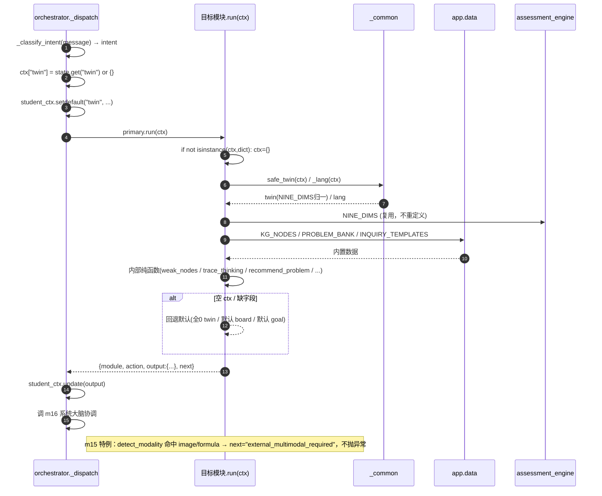
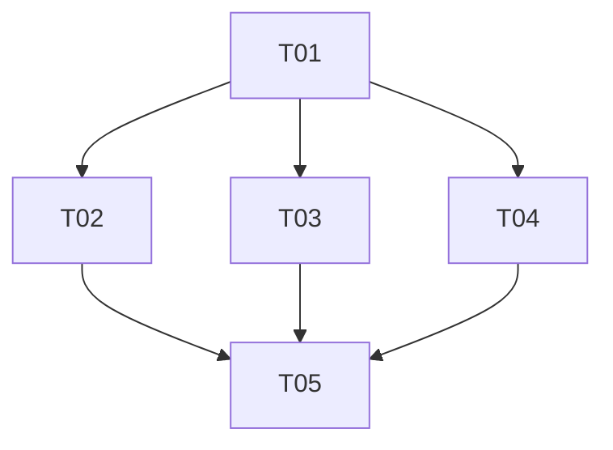

# POMOS 本轮模块落地 · 系统架构设计 + 任务分解（架构师 高见远）

> 仅设计，不写实现。已对 `base.py` / `m08_teaching_strategy.py` / `m10_olympiad_coaching.py` / `assessment_engine.py` / `config.py` / `orchestrator.py` / `__init__.py` / `pomosData.ts` / 9 个 stub / 测试 逐行核验。
> 设计目标：8 个 stub 落地（m01/m02/m03 静态配置 + m06/m07/m09/m11/m12 真实离线逻辑）+ m15 结构化降级 + 双语 + 防御式回退，全部对齐 m08/m10 范式。

---

## A. 实现方案 + 框架选型

**结论：纯 Python 规则引擎，零新依赖。** 全部逻辑走本地确定性函数（与 m08/m10 同范式），不接 LLM、不引第三方库。离线可 pytest、可被 orchestrator 直接调度。**本轮不改动 `orchestrator.py` 与 `modules/__init__.py`**（接线已就位）。

- **技术难点**：8 个 stub 落地 + 1 个结构化降级 + 双语 + 防御式回退，无算法不确定性；用「规则表 + 内置数据 + NINE_DIMS 个性化」即可覆盖全部验收标准。
- **框架/库选型**：沿用既有 `ModuleBase` 抽象基类、`settings.coach_language`、`assessment_engine.NINE_DIMS` / `detect_misconceptions`、`logging.getLogger("pomos.module.<id>")`。
- **架构模式**：每个模块 = 「模块类（装配 `run`）+ 模块级纯函数（可单测）」，与 m08/m10 完全一致；纯函数不带状态、可独立 import 测试。

---

## B. 文件列表及相对路径

### 新增文件
```
backend/app/modules/_common.py                  # 共享辅助：_lang / safe_twin / pick / WEAK_THRESHOLD
backend/app/data/__init__.py                    # 数据层包（使 app.data 可被 import）
backend/app/data/kg_core.py                     # 六层 KG 知识库（节点/边/板块/维度映射）—— m06/m09/m11 共用真相源
backend/app/data/problem_bank.py                # 竞赛题库（OPIE 题源）—— m09 使用
backend/app/data/inquiry_templates.py           # 实验模板库（SIEE）—— m11 使用
backend/tests/test_m06_knowledge_graph.py       # 新增单测（≥1 正常 + ≥1 防御式回退）
backend/tests/test_m07_physics_thinking.py      # 新增单测
backend/tests/test_m09_olympiad_problem.py      # 新增单测
backend/tests/test_m11_scientific_inquiry.py    # 新增单测
backend/tests/test_m12_learning_orchestration.py# 新增单测
backend/tests/test_m01_identity.py              # 新增单测（双语 + 防御式）
backend/tests/test_m03_philosophy.py            # 新增单测（双语 + 防御式）
```

### 修改文件
```
backend/app/modules/m01_identity.py             # 改：加 service_boundary 清单 + 双语
backend/app/modules/m02_mission.py              # 改：丰富输出（使命/原则/首性原理）+ 双语对齐
backend/app/modules/m03_philosophy.py           # 改：加 philosophy_templates(≥3) + 双语
backend/app/modules/m06_knowledge_graph.py      # 改：真实薄弱点定位 + 前置路径（消费 twin）
backend/app/modules/m07_physics_thinking.py     # 改：十阶段思维轨迹（消费 message/twin）
backend/app/modules/m09_olympiad_problem.py     # 改：检索/改编 + 解析（消费 board/difficulty/twin）
backend/app/modules/m11_scientific_inquiry.py   # 改：SIEE 实验设计/误差/拟合（消费 message/twin）
backend/app/modules/m12_learning_orchestration.py# 改：ALOE 周/日计划 + 艾宾浩斯（消费 twin）
backend/app/modules/m15_multimodal.py           # 改：结构化降级（维持 stub 状态，不抛异常）
frontend/lib/pomosData.ts                       # 改：MODULE_STATUS m01/m02/m03/m06/m07/m09/m11/m12 → live；m15 维持 stub 注明降级
```

### 不改动
`orchestrator.py`（接线已就位）、`modules/__init__.py`（已注册 16 模块）、`config.py`、`assessment_engine.py`、`m08`、`m10`。

---

## C. 数据结构和接口

### C.1 共享辅助 `backend/app/modules/_common.py`（跨模块复用，消除 m08/m10 重复）
```python
from typing import Any, Dict, Optional
from app.modules.assessment_engine import NINE_DIMS
from app.config import settings

WEAK_THRESHOLD: float = 0.5  # twin 某维 < 0.5 视为薄弱（与 m08 一致，统一放此处）

def _lang(ctx: Optional[Dict[str, Any]] = None) -> str:
    """统一语言推断：ctx 可覆盖（ctx["lang"] in {zh,en}），否则取 settings.coach_language。"""
    if isinstance(ctx, dict) and ctx.get("lang") in ("zh", "en"):
        return ctx["lang"]
    return (settings.coach_language or "zh").lower()

def safe_twin(ctx: Dict[str, Any]) -> Dict[str, float]:
    """从 ctx 抽取 NINE_DIMS 归一化 twin（缺字段按 0）。供 m06/m07/m09/m11/m12 复用。
    读取顺序：ctx["twin"] → ctx["student_ctx"]["twin"] → 全 0。"""
    student_ctx = ctx.get("student_ctx") if isinstance(ctx.get("student_ctx"), dict) else {}
    raw = ctx.get("twin") or student_ctx.get("twin") or {}
    if not isinstance(raw, dict):
        raw = {}
    return {d: float(raw.get(d, 0.0) or 0.0) for d in NINE_DIMS}

def pick(zh: str, en: str, ctx: Optional[Dict[str, Any]] = None) -> str:
    """按当前语言选文案：pick(zh_str, en_str, ctx)。"""
    return en if _lang(ctx) == "en" else zh
```

### C.2 数据层 `backend/app/data/kg_core.py`（六层 KG；m06/m09/m11 共用真相源）
```python
KG_LAYERS = ["board", "theme", "concept", "model", "method", "pitfall"]
KG_BOARDS = ["力学", "电磁学", "热学", "光学", "近代物理"]   # 与前端 physicsKB.KG_BOARDS 对齐

# 概念级节点：dims=该节点锻炼的 NINE_DIMS；prerequisites=前置节点 id（六层中的 prerequisite 边）
KG_NODES: List[Dict] = [
  {"id":"kinematics","name":"运动学","board":"力学","layer":"concept",
   "dims":["calculation","modeling"],"difficulty":2,"importance":4,"prerequisites":[]},
  {"id":"newton","name":"牛顿定律","board":"力学","layer":"concept",
   "dims":["concept","reasoning"],"difficulty":3,"importance":5,"prerequisites":["kinematics"]},
  {"id":"energy","name":"能量守恒","board":"力学","layer":"concept",
   "dims":["reasoning","modeling"],"difficulty":3,"importance":5,"prerequisites":["newton"]},
  {"id":"rotation","name":"刚体转动","board":"力学","layer":"concept",
   "dims":["modeling","calculation"],"difficulty":4,"importance":5,"prerequisites":["newton","energy"]},
  {"id":"oscillation","name":"振动与波","board":"力学","layer":"concept",
   "dims":["modeling","calculation"],"difficulty":3,"importance":4,"prerequisites":["energy"]},
  {"id":"electrostatic","name":"静电场","board":"电磁学","layer":"concept",
   "dims":["concept","reasoning"],"difficulty":3,"importance":4,"prerequisites":[]},
  {"id":"circuit","name":"恒定电流","board":"电磁学","layer":"concept",
   "dims":["calculation","reasoning"],"difficulty":2,"importance":4,"prerequisites":["electrostatic"]},
  {"id":"magnetic","name":"磁场","board":"电磁学","layer":"concept",
   "dims":["concept","reasoning"],"difficulty":4,"importance":5,"prerequisites":["electrostatic"]},
  {"id":"em_induction","name":"电磁感应","board":"电磁学","layer":"concept",
   "dims":["concept","reasoning","modeling"],"difficulty":5,"importance":5,"prerequisites":["energy","magnetic"]},
  {"id":"thermo","name":"热学","board":"热学","layer":"concept",
   "dims":["concept","calculation"],"difficulty":3,"importance":3,"prerequisites":[]},
  {"id":"optics","name":"光学","board":"光学","layer":"concept",
   "dims":["concept","calculation"],"difficulty":3,"importance":3,"prerequisites":[]},
  {"id":"modern","name":"近代物理","board":"近代物理","layer":"concept",
   "dims":["concept","reasoning"],"difficulty":4,"importance":4,"prerequisites":[]},
]
KG_LINKS: List[Dict] = [  # relation: prerequisite | transfer
  {"source":"kinematics","target":"newton","relation":"prerequisite"},
  {"source":"newton","target":"energy","relation":"prerequisite"},
  {"source":"newton","target":"rotation","relation":"prerequisite"},
  {"source":"energy","target":"rotation","relation":"prerequisite"},
  {"source":"energy","target":"oscillation","relation":"prerequisite"},
  {"source":"electrostatic","target":"circuit","relation":"prerequisite"},
  {"source":"electrostatic","target":"magnetic","relation":"prerequisite"},
  {"source":"energy","target":"em_induction","relation":"transfer"},
  {"source":"magnetic","target":"em_induction","relation":"prerequisite"},
  {"source":"rotation","target":"magnetic","relation":"transfer"},
]
```

### C.3 数据层 `problem_bank.py` / `inquiry_templates.py`（节选结构）
```python
# problem_bank.py：每题 考点 不变、difficulty 1~5 档位
PROBLEM_BANK: List[Dict] = [
  {"id":"p-em-01","board":"电磁学","difficulty":5,"topic":"导体棒切割","考点":["em_induction","energy"],
   "statement":"...","solution":"...","source":"CPhO 复赛"},
  # ≥6 题覆盖 力学/电磁学/热学/光学/近代物理，难度档位 2~5
]
# inquiry_templates.py：每个实验模板含 SIEE 步骤、典型误差源与不确定度类、拟合类型
INQUIRY_TEMPLATES: List[Dict] = [
  {"goal_keywords":["重力加速度","g"],"name":"单摆测 g","siee_steps":[...],
   "error_sources":[{"name":"摆长读数","uncertainty_class":"B"}],"fit_type":"linear"},
  # ≥3 模板
]
```

### C.4 各模块核心纯函数签名（实现级，供工程师直接落地）
```python
# ---- m01_identity ----
def build_identity(lang: str) -> Dict: ...
# run -> output: {persona, tone, scope, service_boundary:List[str], student_id}

# ---- m03_philosophy ----
PHILOSOPHY_TEMPLATES: List[Dict]   # ≥3：苏格拉底式提问 / 脚手架递进 / 元认知反思；每项含 zh/en 文案
def build_philosophy(lang: str) -> Dict: ...
# run -> output: {style, scaffolding, philosophy_templates:List[Dict]}

# ---- m06_knowledge_graph ----
def _node_mastery(node: Dict, twin: Dict[str,float]) -> float: ...   # mean(twin[d] for d in node["dims"])*100
def weak_nodes(top_n: int = 5, lang: str = "zh",
               board: str | None = None) -> List[Dict]: ...          # 取 KG_NODES，按 student mastery 升序 + importance 降序
def prereq_path(node_id: str) -> List[str]: ...                      # BFS 沿 prerequisite 边到根，返回节点名链
# run -> output: {nodes:List[{name,board,mastery,difficulty,prerequisite_path}],
#                 layers:int(=6), top_n:int, weak_dim_summary:List[str]}

# ---- m07_physics_thinking ----
THINKING_STAGES: List[Dict]   # 10 阶段，含 name_zh/name_en + 默认 hint 模板
def _stage_status(stage: Dict, twin: Dict, message: str) -> str: ... # "ok"|"warn"|"risk"
def trace_thinking(message: str, twin: Dict, lang: str = "zh") -> List[Dict]: ...
# 每阶段: {stage_no:int, name:str, status:str, hint:str}
# run -> output: {stages:List[Dict], stage_count:int(=10), summary:str}

# ---- m09_olympiad_problem ----
def match_difficulty(twin: Dict, requested: int | None) -> int: ...  # 档位匹配学情（弱则降档、强则升档，封 1~5）
def recommend_problem(board: str, difficulty: int, lang: str = "zh") -> Dict: ...
def adapt_problem(problem: Dict, target_difficulty: int, lang: str = "zh") -> Dict: ...  # 考点不变，仅调难度档与数值
# run -> output: {problems:List[{id,board,difficulty,topic,考点,statement,solution,source}],
#                 adapted:bool, match_note:str}

# ---- m11_scientific_inquiry ----
def design_experiment(goal: str, twin: Dict, lang: str = "zh") -> Dict: ...   # SIEE 五步
def error_analysis(goal: str, lang: str = "zh") -> Dict: ...                  # 含 uncertainty(A类多次测量标准差 / B类仪器允差/√3)
def data_fitting(goal: str, lang: str = "zh") -> Dict: ...                    # 拟合类型 + 关键公式占位
# run -> output: {experiment_design:Dict, error_analysis:Dict(含 uncertainty), data_fitting:Dict}

# ---- m12_learning_orchestration ----
EBBINGHAUS_INTERVALS = [1, 2, 4, 7, 15, 30]   # 天（编码进复习节点 interval_day）
def priority_score(twin: Dict, weak_items: List[str]) -> float: ...
def weekly_plan(twin: Dict, weak_items: List[str], lang: str = "zh") -> List[Dict]: ...
def daily_plan(weekly: List[Dict], lang: str = "zh") -> List[Dict]: ...       # 复习节点带 interval_day
# run -> output: {weekly_plan:List, daily_plan:List, priority_score:float}

# ---- m15_multimodal ----
def detect_modality(ctx: Dict) -> str: ...   # "text" | "image" | "formula"
# run -> output: {modalities:List[str], ocr:None, external_required:bool(=True),
#                 reason:str, next:"external_multimodal_required"}
```

### C.5 各模块 `run(ctx)` 输入消费与输出结构（逐模块契约，对应验收 2-6 + 7）

| 模块 | 从 ctx 取什么 | 调哪些内部函数 / 数据 | output 关键 key | 验收映射 |
|---|---|---|---|---|
| **m01** | `student_id`（仅记录）；其余静态 | `build_identity(lang)` | `persona, tone, scope, service_boundary[], student_id` | 标准1：`MODULE_STATUS=live` + 含 `service_boundary` |
| **m02** | 基本静态 | `build_mission(lang)` | `mission, principles[], first_principles[]` | 标准1（`live`） |
| **m03** | 基本静态 | `build_philosophy(lang)`（用 `PHILOSOPHY_TEMPLATES`） | `style, scaffolding, philosophy_templates[]`（≥3） | 标准1：`live` + 含 `philosophy_templates`(≥3) |
| **m06** | `twin`（经 `safe_twin`）→ 计算节点 student-mastery；`student_ctx`/ `message` 关键词推断 board 过滤 | `weak_nodes(top_n, lang, board)`、`prereq_path(id)`、`KG_NODES/KG_LINKS` | `nodes[](name,board,mastery,difficulty,prerequisite_path), layers=6, top_n, weak_dim_summary[]` | 标准2：top-N(默认5) 弱节点 + 各自 prereq 路径；空 ctx 不抛 |
| **m07** | `message`（题面）；`twin`（定每阶段 status/hint 强度） | `trace_thinking(message, twin, lang)`、`THINKING_STAGES` | `stages[](stage_no,name,status,hint), stage_count=10, summary` | 标准3：十阶段全覆盖、每阶段含 status+hint |
| **m09** | `student_ctx`(board/difficulty)、`message` 关键词、`twin`（档位匹配） | `match_difficulty`、`recommend_problem`、`adapt_problem`、`PROBLEM_BANK` | `problems[](id,board,difficulty,topic,考点,statement,solution,source), adapted, match_note` | 标准4：≥1 题+解析；改编考点不变、档位匹配 |
| **m11** | `message`（实验目标）；`twin`（误差深度） | `design_experiment`、`error_analysis`、`data_fitting`、`INQUIRY_TEMPLATES` | `experiment_design, error_analysis{uncertainty,...}, data_fitting` | 标准5：含三项，error_analysis 含 uncertainty |
| **m12** | `twin`（弱维驱动）；`message`/`student_ctx` 推断 goal_type；可选 `student_ctx.weak_bugs` | `priority_score`、`weekly_plan`、`daily_plan`、`EBBINGHAUS_INTERVALS` | `weekly_plan[], daily_plan[](含 interval_day), priority_score` | 标准6：含三项；复习节点编码艾宾浩斯间隔 |
| **m15** | `ctx.image`/`ctx.formula`/`message` 图片标记 | `detect_modality(ctx)` | `modalities[], ocr:None, external_required=True, reason, next="external_multimodal_required"` | 标准（降级）：检测图片/公式 → 结构化降级不抛 |

> **防御式统一**：每个 `run` 开头 `if not isinstance(ctx, dict): ctx = {}`；缺 `student_ctx`/`twin`/`message` 一律回退默认（全 0 twin / 默认 board=力学 / 默认 goal）；空 ctx 必须返回结构完整的合法 dict、绝不抛异常（验收标准 7）。

### C.6 类图（Mermaid）
> 另存 `docs/class-diagram.mermaid`，下图为核心关系。

```mermaid
classDiagram
    class ModuleBase {
        <<abstract>>
        +name: str
        +layer: str
        +spec: str
        +run(ctx: dict) dict*
    }
    class CommonHelpers {
        <<module app.modules._common>>
        +WEAK_THRESHOLD: float
        +_lang(ctx) str
        +safe_twin(ctx) dict
        +pick(zh, en, ctx) str
    }
    class DataLayer {
        <<package app.data>>
        KG_NODES / KG_LINKS / KG_BOARDS
        PROBLEM_BANK
        INQUIRY_TEMPLATES
    }
    class AssessmentEngine {
        <<module>>
        +NINE_DIMS: list
        +detect_misconceptions(msg, lang) list
    }
    class IdentityModule { +run(ctx) dict }
    class MissionModule { +run(ctx) dict }
    class PhilosophyModule { +run(ctx) dict }
    class KnowledgeGraphModule { +run(ctx) dict +weak_nodes() +prereq_path() }
    class PhysicsThinkingModule { +run(ctx) dict +trace_thinking() }
    class OlympiadProblemModule { +run(ctx) dict +recommend_problem() +adapt_problem() }
    class ScientificInquiryModule { +run(ctx) dict +design_experiment() +error_analysis() +data_fitting() }
    class LearningOrchestrationModule { +run(ctx) dict +weekly_plan() +daily_plan() +priority_score() }
    class MultimodalModule { +run(ctx) dict +detect_modality() }

    ModuleBase <|-- IdentityModule
    ModuleBase <|-- MissionModule
    ModuleBase <|-- PhilosophyModule
    ModuleBase <|-- KnowledgeGraphModule
    ModuleBase <|-- PhysicsThinkingModule
    ModuleBase <|-- OlympiadProblemModule
    ModuleBase <|-- ScientificInquiryModule
    ModuleBase <|-- LearningOrchestrationModule
    ModuleBase <|-- MultimodalModule

    IdentityModule ..> CommonHelpers : _lang/pick
    PhilosophyModule ..> CommonHelpers : _lang/pick
    KnowledgeGraphModule ..> CommonHelpers : safe_twin/_lang
    KnowledgeGraphModule ..> DataLayer : KG_NODES/KG_LINKS
    PhysicsThinkingModule ..> CommonHelpers : safe_twin/_lang
    OlympiadProblemModule ..> CommonHelpers : safe_twin/_lang
    OlympiadProblemModule ..> DataLayer : PROBLEM_BANK
    ScientificInquiryModule ..> CommonHelpers : safe_twin/_lang
    ScientificInquiryModule ..> DataLayer : INQUIRY_TEMPLATES
    LearningOrchestrationModule ..> CommonHelpers : safe_twin
    MultimodalModule ..> CommonHelpers : _lang

    KnowledgeGraphModule ..> AssessmentEngine : NINE_DIMS
    PhysicsThinkingModule ..> AssessmentEngine : NINE_DIMS
    OlympiadProblemModule ..> AssessmentEngine : NINE_DIMS
    ScientificInquiryModule ..> AssessmentEngine : NINE_DIMS
    LearningOrchestrationModule ..> AssessmentEngine : NINE_DIMS
```



---

## D. 程序调用流程（时序图）

`orchestrator._dispatch` 已按意图直接调用 `primary.run(ctx)`（coaching 特例走 m08→m10，已就位）。本轮真实模块（m06/m07/m09/m11/m12）均走 `else` 单模块分支，**不跨模块调用**；依赖数据经 `ctx["twin"]`（orchestrator 注入）与共享 `app/data/` 复用。

> 另存 `docs/sequence-diagram.mermaid`。



---

## E. 任务列表（有序、含依赖，按实现顺序）

> 分组原则：共享基础前置 → 静态配置类 → 真实逻辑分层（知识层 / 教学层）→ 测试+前端收尾。每任务 ≥3 文件，仅 T01 为根依赖，T03/T04 可并行。

| 序 | 任务 | 涉及文件 | 依赖前置 | 验收点 |
|---|---|---|---|---|
| **T01** | 共享基础与数据层 | `app/modules/_common.py`；`app/data/__init__.py`、`app/data/kg_core.py`、`app/data/problem_bank.py`、`app/data/inquiry_templates.py` | — | `_lang`/`safe_twin`/`pick` 可用；`KG_NODES≥12`、题库 `≥6`、实验模板 `≥3` 可 import；纯函数零 I/O |
| **T02** | 静态 Persona 落地 m01/m02/m03 | `m01_identity.py`、`m02_mission.py`、`m03_philosophy.py`、`frontend/lib/pomosData.ts`（m01/m02/m03 状态） | T01 | m01 含 `service_boundary`；m03 含 `philosophy_templates`(≥3)；`MODULE_STATUS` m01/m02/m03=`live`；双语 key 齐 |
| **T03** | 知识层真实逻辑 m06/m07 + m15 降级 | `m06_knowledge_graph.py`、`m07_physics_thinking.py`、`m15_multimodal.py` | T01 | m06 top-N(默认5) 弱节点 + 各自 `prerequisite_path`，空 ctx 不抛；m07 十阶段全非空含 `status`+`hint`；m15 返回 `external_required`+`next` 不抛 |
| **T04** | 教学层真实逻辑 m09/m11/m12 | `m09_olympiad_problem.py`、`m11_scientific_inquiry.py`、`m12_learning_orchestration.py` | T01 | m09 ≥1 题+解析、改编考点不变档位匹配；m11 含 `experiment_design`/`error_analysis`(uncertainty)/`data_fitting`；m12 含 `weekly_plan`/`daily_plan`/`priority_score`，复习节点含 `interval_day`；空 ctx 不抛 |
| **T05** | 测试 + 前端状态翻转收尾 | `test_m06_knowledge_graph.py`、`test_m07_physics_thinking.py`、`test_m09_olympiad_problem.py`、`test_m11_scientific_inquiry.py`、`test_m12_learning_orchestration.py`、`test_m01_identity.py`、`test_m03_philosophy.py`；`frontend/lib/pomosData.ts`（m06/m07/m09/m11/m12→live，m15 注明降级） | T02,T03,T04 | 每个真实模块 ≥1 正常 + ≥1 防御式回退用例；m01/m03 双语用例；`pytest` 离线全绿；`MODULE_STATUS` 全部对齐 |

### 任务依赖图（Mermaid）

> T03 与 T04 互相独立、仅依赖 T01，可并行实施；T05 收口统一验证。

---

## F. 依赖包列表

**本轮不新增任何 pip 依赖。** 复用既有生态：
- `pydantic-settings`（配置，已在 `config.py`）
- 标准库：`logging` / `typing` / `json` / `math`（规则引擎所需）
- `pytest`（测试，已在 `backend/tests/`）

**结论**：纯 Python 规则引擎，零新依赖，满足离线 pytest 与 orchestrator 直接调度。

---

## G. 共享知识（跨文件约定，工程师必读）

1. **`_lang(ctx)` 约定**：所有模块统一 `from app.modules._common import _lang`；`en = _lang(ctx) == "en"`；静态文案用 `pick(zh, en, ctx)` 或内联 `if en:`。新增 `ctx["lang"]` 覆盖位，向后兼容 m08/m10 的 `settings.coach_language` 用法。
2. **twin 抽取统一**：一律 `safe_twin(ctx)`，删除各模块内重复的 `{d: float(raw.get(d,0.0) or 0.0) for d in NINE_DIMS}`（消除 m08/m10 现有重复）。
3. **日志命名**：`logger = logging.getLogger("pomos.module.<id>")`；`run` 内关键路径 `logger.info("mXX ...")`。
4. **防御式回退范式**：`run` 首行 `if not isinstance(ctx, dict): ctx = {}`；`student_ctx`/`twin`/`message` 缺则回退默认；空 ctx 返回结构完整合法 dict、**绝不抛异常**（验收 7）。
5. **NINE_DIMS 复用**：从 `app.modules.assessment_engine` 导入，禁止重定义。
6. **返回结构契约**：严格 `{"module": self.name, "action": ..., "output": {...}, "next": ...}`；`next` 延续既有链：m01→m02→m03→m04…，m06→m07，m09→m10，m11→m12，m15→（特例）`"external_multimodal_required"`。
7. **双语测试手法**：测试用 `settings.coach_language = "en"` 切换，结束 `try/finally` 还原；不依赖 ctx 注入（与现有 `_lang` 兼容）。
8. **数据层单源**：KG / 题库 / 实验模板只放 `app/data/`，模块逻辑只 import 不内联大段数据，保证可测试、可维护、可共享。

---

## H. 待明确事项（本轮拍板 + 需确认）

### 已替工程师决策（推荐，可直接落地）
- **H1 数据放哪**：→ `backend/app/data/` 独立文件（`kg_core` / `problem_bank` / `inquiry_templates`）。理由：可测试（直接 import 断言）、可维护（编辑数据不碰逻辑）、m06/m09/m11 共用单源、对齐「数据/逻辑分离」。
- **H2 跨模块依赖是否运行时调用**：→ **否**。本轮 `run()` 内不显式调用其它模块。`m06←m04`、`m07←m05/m06`、`m09←m06/m14`、`m11←m06/m07`、`m12←m05/m10` 的"依赖"通过 (a) orchestrator 已注入 `ctx["twin"]` / `ctx["memory"]` / `ctx["student_ctx"]` 复用计算结果，及 (b) 共享 `app/data/` + `assessment_engine` 复用逻辑达成。**不改 orchestrator**。
- **H3 双语覆盖范围**：→ m01、m03（静态类强制）+ m06（真实逻辑代表，覆盖 top-N 标签 / prereq 路径 / summary 英文化）；其余模块用 `_lang` 框架就绪，交付可只保证 zh 完整 + en 关键字段（不阻塞验收 9）。
- **H4 weak 阈值**：→ 沿用 m08 的 `WEAK_THRESHOLD = 0.5`，统一放 `_common`。
- **H5 m15 降级触发**：→ `run` 检测 `ctx.get("image")` / `ctx.get("formula")` / `message` 含图片标记 → 返回 `external_required=True` + `next="external_multimodal_required"`；纯文本走原路径。绝不抛异常。
- **H6 模块 `next` 链**：→ 维持既有静态 next（不接 m08/m10 之外的跨模块 run 调用），保证 orchestrator 行为一致。

### 需 team-lead / PM 确认的开放项
- **Q1 KG/题库规模**：本设计内置 12 概念节点 + 6 竞赛题 + 3 实验模板（对齐前端 `KG_NODES` 并补 `dims`/`layer`/`prerequisites`）。是否要更大规模（如 30+ 节点 / 20+ 题）？默认先小后扩，数据文件即扩即生效。
- **Q2 m12 目标来源**：默认从 `ctx["message"]` 关键词推断 `goal_type`（复用 m08._infer_goal 思路）+ `twin` 弱维驱动；是否要读 `ctx["memory"]` 的 bug 列表？默认读 `student_ctx.get("weak_bugs")` 可选，缺则按 twin 弱维。
- **Q3 双语是否要求 m09/m11/m12 全量 en**：验收 9 仅要求「至少 m01/m03 + 任一真实逻辑模块」，故默认只 m06 做全量 en，其余保留 zh 完整 + 框架就绪。如需全量请明示。
- **Q4 m06 节点 student-mastery 口径**：=`mean(twin[d] for d in node["dims"]) * 100`；若 `node["dims"]` 为空则回退节点静态 `importance`。是否接受？默认接受。
- **Q5 m11 误差计算深度**：本设计为规则级（`uncertainty` 给出 A类=多次测量标准差、B类=仪器允差/√3 的结构化字段与示例数值），不做真实数值拟合运算。如需真实最小二乘数值，请确认是否引入 `numpy`（将突破「零新依赖」）。
