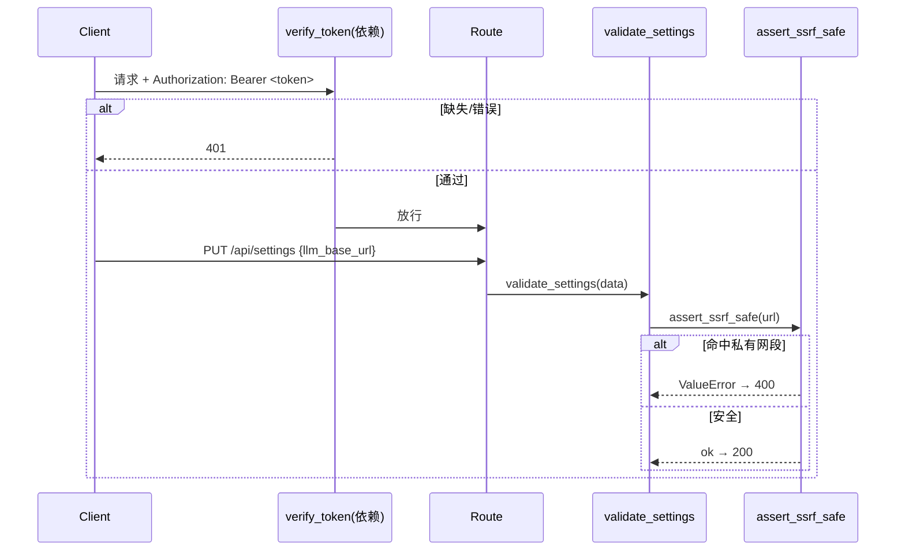

# POMOS 技术债清偿 — 架构设计（高见远）

> 范围：③ 后端零认证 + SSRF 安全设计；①②③⑤ 任务分解。仅设计，无实现代码。结论均已源码核验。

## 一、③ 安全设计

### 1.1 认证：可选共享密钥 Bearer 中间件
新建 `backend/app/security.py`，读取环境变量 `POMOS_API_TOKEN`：
- **未设置** → 认证关闭（本地/离线开发友好）；
- **已设置** → 所有路由要求 `Authorization: Bearer <token>`，缺失或错误返回 `401`；
- `PUT /api/settings` 覆写系统级 LLM 密钥与 CORS，**始终受保护**（复用同 token，或独立 `POMOS_ADMIN_TOKEN`）。

关键函数签名（仅签名）：
```python
# backend/app/security.py
async def verify_token(req: Request) -> str:
    """FastAPI 依赖：校验 Bearer；失败抛 401。token 未启用时直接放行。"""

def assert_ssrf_safe(url: str) -> None:
    """对 llm_base_url 做 DNS 解析与网段黑名单；非法抛 ValueError。"""
```

### 1.2 SSRF 防护
`assert_ssrf_safe` 在 `validate_settings` 中调用，命中则 `validate_settings` 返回错误、`PUT /api/settings` 回 `400`。拒绝目标：
- RFC1918：`10.0.0.0/8`、`172.16.0.0/12`、`192.168.0.0/16`
- 链路本地 `169.254.0.0/16`、`0.0.0.0`、回环 `127.0.0.0/8` 与 IPv6 `::1`
- **先校验解析后 IP 再使用 URL**（防 DNS rebinding：校验与请求用同一解析结果）

### 1.3 调用流程


### 1.4 需改动文件
1. **新建** `backend/app/security.py`
2. `backend/app/main.py`：`include_router` 加 `dependencies=[Depends(verify_token)]`（或全局中间件）
3. `backend/app/config.py`：`validate_settings` 内调用 `assert_ssrf_safe`
4. `backend/app/api/routes/settings.py`：`put_settings` 强制 `Depends(verify_token)`

## 二、任务分解（①②③⑤，按实现顺序）

| 序 | 任务 | 文件 | 改动点（设计） | 依赖 |
|---|---|---|---|---|
| 1 | ① uuid 导入 | `backend/app/api/routes/chat.py` | L13 补 `import uuid`；兜底分支 `uuid.uuid4()` 即可解析（当前跨模块未导入，异常路径必抛 NameError） | 无 |
| 2 | ② signal 透传 | `frontend/lib/api.ts` L309；`frontend/lib/offlineApi.ts` `streamChat` | `api.ts`：`offline.streamChat(input, handlers, signal)`；`offlineApi.ts`：`streamChat(input, handlers, signal?)`，for 循环每轮检查 `signal?.aborted` 提前退出（不可中止问题闭环） | 无 |
| 3 | ⑤ PQ 统一 | `frontend/lib/offlineApi.ts` | 新增单源 `pqFromTwin(twin)=clamp(0.2+0.8*mean,0,0.99)`；`buildStudentUpdate` 改用它并删除 `rng()*0.02` 抖动；`mockPq` 收敛到同源；消除顶栏 PQ 与 `getDashboard` 割裂 | 无 |
| 4 | ③ 认证+SSRF | `security.py`(新)→`main.py`→`config.py`→`settings.py` | 内部顺序：新建 security.py → main.py 接依赖 → config.py 接 assert_ssrf_safe → settings 路由注入 verify_token | ①②③⑤ 验证后 |

## 三、共享知识（跨文件约定）
- **信号透传**：`streamChat(input, handlers, signal?)` 第三参全链路透传；离线实现在 `sleep(16)` 循环内检查 `signal?.aborted` 并调用 `handlers.onError` 退出，行为对齐 online 分支。
- **PQ 单源**：`pqFromTwin(twin)` 置于 `offlineApi.ts` 顶部；`createStudent`/`applyMasteryDelta`/`buildMockFromTwin`(已一致) 与 `buildStudentUpdate` 全部调用，删除随机抖动，保证顶栏与仪表盘同源。
- **统一错误返回**：后端经 `main.py` 全局异常处理器已统一为 `{error, request_id}`；离线 `onError(detail)` 文案与 online 分支保持一致，避免两套提示。

## 四、待明确事项
- **静态前端 × 认证**：GitHub Pages 静态导出无法安全存 `POMOS_API_TOKEN`（入前端即公开）。**推荐**：静态前端默认不带 token、走离线模式根本不请求后端；认证仅保护「自托管后端」受信任调用方（admin/部署态）。即浏览器侧默认跳过鉴权，`PUT /api/settings` 在静态场景本就不可达。需 team-lead 确认此推荐项，并在部署文档标注「静态站 ≠ 受保护后端」。

→ 下一步：请将本报告交工程师寇豆码，按实现顺序 **① → ② → ⑤ → ③** 落地。
